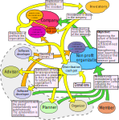

# Democratic software development project

This is an idea how to organize a big software development project in a way that it fulfills the following criteria:
* The whole project is organized democratically.
* Everybody can work completely voluntary at the project. There is no obligation involved.
* The created software should bring a benefit for the society.
* Every participant gets paid for his work even if the software product is still in development.
* Every participant is rewarded proportional to the work he has done for the project.

A requirement for the project is a software product that can be licensed both for profit and non profit and is expected to bring enough money to compensate for the programming effort.

The software development project can than be organized in the following way:

The core element of the project is a non profit organization. This organization has a common good-oriented objective and is democratically managed by its members. It has a pot of money that is meant to be used for paying people proportional to their work they have done to serve the objectives of the organization.

The second core element of the project is a company. This company is only needed if investors invest money in the project so the software developers can be paid in advance, even if the software product does not jet generate any profit. The non profit organization holds shares of more than 50% of the company. The other shares can be sold to to the investors.

The business model works by the software developers donating the commercial licences of their work to the company and open sourcing the non commercial licenses of their work. The company uses these licenses to earn money which flows into the cash pot of the non profit organization. This cash pot is than used to pay everyone who put effort in the objectives of the non profid organization including the software developers.