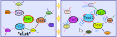
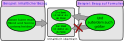

# Diskussionsforum auf Basis eines semantischen Netzes - Konzeptentwurf	
## Motivation

Wenn man öffentlich eine sachliche Diskussion über ein komplexes Thema führen will, ist es wichtig für diesen Zweck eine geeignete Plattform zu wählen. Dieser Konzeptentwurf ist ein Vorschlag, wie eine solche Plattform gestaltet sein könnte, sodass bestmögliche Bedingungen dafür gegeben sind.

Insbesondere sollen zwei Funktionen unterstützt werden, die in vielen herkömmlichen Diskussionsforen fehlen:

### Fehlende Unterstützung netzwerkartiger Diskussionstopographien

Während reale Probleme aus vielen unterschiedlichen Teilfragen bestehen, die aufeinander aufbauen und netzwerkartig voneinander abhängen, sind die gängigen Chat-Werkzeuge meist linearer Natur und bilden höchstens noch die Möglichkeit baumartiger Verästelungen in Form von Sub-Threads.

Was jedoch in den meisten Fällen nicht unterstützt wird, ist die Möglichkeit sich in einer Diskussion direkt auf einen Kommentar zu beziehen, der in einer komplett anderen Debatte vorkommt und dadurch beide Diskussionsstränge miteinander zu verbinden.

### Fehlende Zusammenführung identischer Kommentare

Ein weiteres Problem bei Debatten im Internet ist, dass inhaltlich identische Fragen an verschiedenen Stellen innerhalb eines Forums auftreten können.

Auf diese Weise kann es dazu kommen, dass unterschiedliche Gruppen von Personen unabhängig voneinander über das selbe Problem diskutieren ohne dass sie sich dessen bewusst sind. Das ist einerseits ineffizient, weil sich so Diskussionsergebnisse, die bereits an anderer Stelle gewonnen wurden, erneut erarbeitet werden müssen. Andererseits kann es auch dazu kommen, dass dabei manche Argumente niemals aufeinandertreffen, weil Menschen dazu neigen bevorzugt mit ähnlich Denkenden zu diskutieren.

Besser wäre es also, wenn identische Fragen innerhalb des Forums zusammengeführt werden würden, so dass sich die gesamte Diskussion über die jeweilige Frage an einer Stelle konzentriert. Die meisten existierenden Internetforen bieten diese Funktion nicht an.
	
## Mindmap-Forum Konzeptentwurf

Das Ziel ist die Implementierung eines Chat-Forums, welches die oben genannten Funktionen bietet und damit die sachliche Diskussion im Internet unterstützt. 

Die Gesamtheit aller Nutzerbeiträge soll eine Netzstruktur bilden, die untereinander durch eine Anzahl verschiedener Relationen verbunden ist.

Jede Relation steht für einen inhaltlichen Zusammenhang von zwei Textbeiträgen.

### Darstellung als Mindmap

Die Navigation durch das Forum soll mit Hilfe einer navigierbaren Mindmap möglich sein.

Für den Nutzer soll dabei zu jedem Zeitpunkt nur ein einzelner Textbeitrag im Fokus stehen, welcher im Zentrum des Bildschirms erscheint.

Ringsum sollen jeweils die damit direkt vernetzten Beiträge als Mindmap angezeigt werden. Die Anzahl der gleichzeitig sichtbaren Beiträge soll dabei jedoch begrenzt sein, um die Übersichtlichkeit zu erhalten.

Die Textbeiträge werden in Ellipsen eingefasst und die Relationen zwischen ihnen als Pfeile dargestellt.

Wenn der Nutzer einen der Beiträge anklickt, soll dieser in das Zentrum des Fensters wandern und die Mindmap entsprechend angepasst werden, sodass nun gegebenenfalls andere Teile des Netzwerks sichtbar sind.

Die einzelnen Beiträge sollen sich dabei automatisch auf der Bildfläche anordnen, um den vorhandenen Platz optimal zu nutzen. Dazu soll die Bewegung der Elemente mit Hilfe von abstoßender und anziehender Potentiale simuliert werden.

### Inhaltliche Strukturierung

Die Textbeiträge und Relationen sind nach inhaltlichen Kriterien in verschiedene Klassen unterteilt, denen jeweils unterschiedliche Farben zugeordnet werden.

Die Klasse eines Textbeitrags soll zeigen, um welche Art von Beitrag es sich handelt, während die Klasse einer Relation angeben soll, welchen Bezug zwei Textbeiträge zueinander haben.

Die Einteilung in Klassen soll nach möglichst eindeutigen Regeln erfolgen und den Betrachter dabei unterstützen, die Übersicht über die Debatte zu behalten.

Es gibt verschiedene Ansätze, die sich darin unterscheiden welche Klassen für die Einteilung von Textbeiträgen und Relationen zur Verfügung stehen. Welche davon sich in der Praxis eignen, soll noch ermittelt werden.

Eine Auswahl an möglichen Beitrags- und Relationsklassen ist in den folgenden Tabellen aufgelistet.
	
	
|Beitragsklasse | Beschreibung | Beispiel|
|---------------|--------------|---------|
|Frage | Text, der eine Fragestellung darstellt | Was ist der Sinn des Lebens?|
|Aussage | Text, der eine Behauptung, Feststellung oder These darstellt | Wissen ist Macht.|
|Aufforderung | Text, der eine Aufforderung darstellt | Mach dir deine eigenen Gedanken.|
|Konzept | Text, der ein oder mehrere Objekte, Handlungen, Lebewesen oder abstrakte Konzepte repräsentiert | Die Menschheit|
|Sonstiges | Texte, die sich nicht eindeutig zuordnen lassen, z.~B. weil sie aus mehreren Sätzen bestehen, die in verschiedene Kategorien fallen. | Moin, ich bin neu hier. Wie funktioniert dieses Forum? Kann mir bitte jemand helfen?|

|Relationsklasse | Beschreibung | Beispiel|
|---------------|--------------|---------|
|Antwort auf | Zeigt an, dass eine Frage von einer Aussage beantwortet wird. | 'Ein Löwe ist gefährlich' beantwortet 'Welches Tier ist gefährlich?'|
|Frage zu | Zeigt an, dass eine Frage sich inhaltlich auf einen anderen Textbeitrag bezieht. | 'Wie viele Sterne kann man am Himmel sehen?' ist Frage zu 'Am Himmel kann man Sterne sehen.'|
|Aussage über | Zeigt an, dass eine Aussage sich inhaltlich auf einen anderen Textbeitrag bezieht. | 'Äpfel sind Rot' ist eine Aussage über 'Apfel'|
|Begründung zu | Zeigt an, dass eine Aussage einer anderen Aussage widerspricht. | 'Physik ist kompliziert' ist ein Widerspruch zu 'Physik ist einfach'|

### Verfassen neuer Beiträge

Zu jedem Zeitpunkt soll der Nutzer die Möglichkeit haben, neue Textbeiträge hinzuzufügen, die sich dann auf den aktuell zentral fokussierten Beitrag beziehen.

Dazu muss er in einem Feld am unteren Rand des Bildschirms einen Text eingeben. Damit ein neuer Beitrag aus dem Inhalt des Textfeldes erzeugt werden kann, muss zuerst ermittelt werden, welcher Beitragsklasse dieser Beitrag zuzuordnen ist und auf welche Weise er zum zentralen Beitrag in Bezug steht.

Das geschieht indem der Nutzer auf einen von mehreren unter dem Textfeld angeordneten Buttons klickt, deren Beschriftung an die jeweiligen möglichen Zuordnungen angepasst ist.

Solche Beschriftungen könnten zum Beispiel sein: 'Auf Frage antworten', 'Frage dazu stellen' oder 'Widersprechen'.

Die zur Auswahl stehenden Optionen sollen dabei an den Beitragstyp des zentral fokussierten Inhalts angepasst sein.

### Optionsmenü

Bei Rechtsklick (bzw. gedrückt halten) auf Relationen und Textbeiträge soll ein Optionsmenü angezeigt werden, über welches man Änderungen durchführen kann. Es soll die Möglichkeit bestehen, Relationen und Textbeiträge zu löschen und deren Klassifikation zu ändern.

Außerdem soll man mit Hilfe dieses Menüs auch neue Relationen zwischen bereits bestehenden Textbeiträgen erzeugen können.

### Zusammenführung

Ein zentrales Feature ist die Möglichkeit, bereits bestehende Textbeiträge, die inhaltlich identisch sind, zu verschmelzen.

Wenn beispielsweise zwei Nutzer an verschiedenen Orten innerhalb des Netzwerks die selbe Frage stellen, ohne voneinander zu wissen, soll ein dritter Nutzer, der dies erkennt, die Möglichkeit haben, beide Beiträge zu verschmelzen.

Danach soll nur noch einer der beiden Textbeiträge angezeigt werden, der aber zusätzlich auch alle Relationen des anderen Textbeitrags übernimmt.

Durch einen kleinen Kasten am oberen Rand des Textbeitrags soll angezeigt werden, dass alternative Formulierungen zur Verfügung stehen, zu denen bei Anklicken mittels eines Auswahlmenüs gewechselt werden kann.

Dadurch soll erreicht werden, dass die gesamte Diskussion über ein Thema auch an einem Ort innerhalb des Netzwerks fokussiert wird, ohne dass sich an unterschiedlichen Stellen Meinungsblasen bilden.

	
### Kriterien für die Zusammenführung

Textbeiträge gehören genau dann fusioniert, wenn sie die exakt gleiche inhaltliche Bedeutung haben.

Textbeiträge deren Inhalt nur ähnlich aber nicht identisch ist gehören nicht fusioniert.

Ist die genaue inhaltliche Bedeutung eines Textbeitrags unklar, so kann der Urheber gefragt werden wie der Textbeitrag gemeint ist. Seine Antwort legt dann die inhaltliche Bedeutung des ursprünglichen Kommentars für die Zukunft fest.

### Kontextabhängige Beiträge

Ein Textbeitrag entsteht immer in einem Kontext. Dieser umfasst alle Rahmenbedingungen, die beim Schreiben des Beitrags geherrscht haben. 

Zu dem Kontext eines Beitrags gehört unter anderem sein Verfasser, der Zeitpunkt seiner Entstehung, der Adressat und der Beitrag auf den er sich bezieht.

Ein Textbeitag kann entweder unabhängig vom Kontext formuliert, oder kontextabhängig sein. In letzterem Fall kann der Inhalt des Beitrags nur dann verstanden werden, wenn mindestens ein Aspekt des Kontextes bekannt ist. Kontextabhängige Beiträge können darin unterschieden werden, auf welchen Aspekt des Kontext sie sich beziehen.

|Art des Kontextbezugs | Beispiel|
|----------------------|---------|
|Kein Kontextbezug | 'Schnee ist weiß.'|
|Bezug auf die Zeit | 'Es hat gerade begonnen zu schneien.'|
|Bezug auf den Verfasser | 'Ich mag Schnee'|
|Bezug auf den Adressat | 'Gehst du oft zum Skifahren in die Berge?'|
|Bezug auf den Inhalt des vorherigen Textbeitrags | 'Nein, dazu fehlt mir die Zeit.'|
|Bezug auf die Formulierung des vorherigen Textbeitrags |& 'Diesen Satz höre ich öfters.'|

Zwei Textbeiträge mit einer identischen, aber kontextabhängigen Formulierung können inhaltlich verschieden sein. In diesem Fall gehören sie also nicht fusioniert.

Andererseits können zwei unterschiedliche kontextabhängige Textbeiträge genau dadurch inhaltlich identisch sein, dass sie aus unterschiedlichen Kontexten stammen. In diesem Fall gehören sie fusioniert.

Wenn sich ein Textbeitrag auf einen anderen bezieht, so ist zu unterscheiden, ob dabei nur der Inhalt oder auch die Formulierung des anderen Beitrags relevant ist. 

Ein rein inhaltlicher Bezug liegt nur dann vor, wenn der Textbeitrag, auf den Bezug genommen wird, durch jeden beliebigen Beitrag mit identischem Inhalt ersetzt werden kann, ohne dass sich die Bedeutung des zweiten Textbeitrags ändert.

### Umgang mit kontextabhängigen Beiträgen

Damit der Inhalt eines Textbeitrags von den Nutzern des Forums richtig bewertet werden kann, ist es wichtig, dass Kontextbezüge auch visuell dargestellt werden.

Dazu soll man zu jeder Formulierung über das Optionsmenü festlegen können, welche Art von Kontextbezug jeweils vorliegt.

Abhängig davon welcher Kontextbezug angegeben wurde, werden nun zusätzliche Informationen zu den Textbeiträgen angezeigt.

Informationen wie Verfasser, Adressat, Datum und Urzeit werden in einem kleinen Textfeld am Rand des Beitrags abgebildet.

Als Verfasser eines Textbeitrags wird der Nutzernahme des Nutzers angegeben, der den Beitrag erstellt hat. Als Adressat wird der Verfasser des Beitrags angegeben, auf den sich der ursprüngliche Beitrag bezieht.

Wird über das Optionsmenü angegeben, dass ein inhaltlicher oder Formulierungsbezug vorliegt, so wird das durch einen Kontext-Pfeil dargestellt. Er zeigt immer zu dem Textbeitrag, auf den bei der Erstellung Bezug genommen wurde.

Der Kontext-Pfeil ist breiter als die Pfeile der Relationen und befindet sich im Hintergrund, so dass er sie nicht verdeckt. 

Seine Farbe gibt an, ob es sich um einen inhaltlichen Bezug oder einen Formulierungsbezug handelt.

Ist die Formulierung, auf die Bezug genommen wird, nicht sichtbar, weil stattdessen eine andere Formulierung mit identischem Inhalt angezeigt wird, so zeigt der Kontextpfeil dennoch zum Knotenpunkt, dem die Formulierung zugeordnet ist.

In diesem Fall ist die Umrandung des Pfeiles jedoch gestrichelt. Wird der gestrichelte Kontext-Pfeil angeklickt, so wird automatisch zu der Formulierung gewechselt, auf die sich der Textbeitrag bezieht.

### Navigation mit Multifokus

Um identische Beiträge von verschiedenen Bereichen des Netzwerks zusammenführen zu können, muss es möglich sein, zu mehreren Stellen gleichzeitig zu navigieren.

Dazu kann der Nutzer über das Optionsmenü eines Textbeitrags diesen als Fokuspunkt hinzufügen. Dieser Beitrag wird nun zum Hauptfokus. Der zuvor fokussierte Beitrag bleibt jedoch im Fokus.

Insgesamt können so mehrere Fokuspunkte erzeugt werden, welche die Gesamtfläche des Fensters gleichmäßig unter sich aufteilen.

Jeder Fokuspunkt bildet das Zentrum seiner eigenen Mindmap. Die Mindmaps der einzelnen Fokuspunkte können untereinander zusammenhängen, müssen es aber nicht.

Wird ein neuer Textbeitrag durch anklicken ausgewählt, so übernimmt er die Rolle des jeweils nächst gelegenen Fokuspunktes.

Zu jedem Zeitpunkt existiert genau ein Hauptfokuspunkt. Das ist immer der Textbeitrag, zu dem als letztes navigiert wurde. Neu hinzugefügte Beiträge beziehen sich immer auf den Hauptfokuspunkt. Der Hauptfokuspunkt ist Rot umrandet, die übrigen Fokuspunkte gelb.

Über das Optionsmenü können Fokuspunkte auch wieder entfernt werden.

## Umsetzung

Die Umsetzung des oben beschriebenen Projektes ist ein sehr umfangreiches Vorhaben. Ein naheliegender Ansatz ist es das Diskussionsforum als Webanwendung zu realisieren.

### Bereits geleistete Arbeit

Um dieses Ziel zu erreichen wurde eine Javascript-Demo in entwickelt um die Navigation durch das Semantische Netz zu erproben: \href{https://debablo.de/demo}{https://debablo.de/demo}