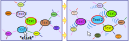
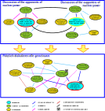
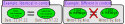
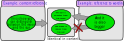
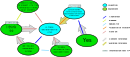

# Discussion forum based on a semantic network - concept draft
## Motivation 

If you want to have a factual discussion about a complex topic in public, it is important to choose a suitable platform for this purpose. This concept draft is a suggestion of how such a platform could be designed so that the best possible conditions are provided for it. In particular, it aims to support two features that are missing from many traditional discussion forums: 
### Lack of support for network-like discussion topographies

While real problems consist of many different sub-questions that build on each other and depend on each other in a network-like manner, the common chat tools are mostly linear in nature and at most only form the possibility of tree-like branches in the form of sub-threads. 
What is not supported in most cases, however, is the possibility of directly referring to a comment in a discussion that occurs in a completely different debate and thereby connecting both threads of discussion.

### Missing merging of identical comments

Another problem with debates on the Internet is that questions with the same content can appear in different places within a forum.

In this way, different groups of people can independently discuss the same problem without being aware of it. On the one hand, this is inefficient because it means that discussion results that have already been obtained elsewhere have to be developed again. On the other hand, it can also happen that some arguments never meet because people tend to prefer to discuss things with people who think similarly.

It would be better if identical questions were merged together within the forum so that the entire discussion about the respective question is concentrated in one place. Most existing Internet forums do not offer this function.

## Mind map forum concept draft

The goal is to implement a chat forum that offers the functions mentioned above and thus supports factual discussion on the Internet.

The totality of all user contributions should form a network structure that is connected to each other by a number of different relationships.

Each relation represents a contextual connection between two text contributions.

### Representation as a mind map

Navigation through the forum should be possible with the help of a navigable mind map.

The user should only focus on a single text article at any time, which appears in the center of the screen.

The directly linked posts should be displayed as a mind map all around. However, the number of posts visible at the same time should be limited in order to maintain clarity.

The text contributions are framed in ellipses and the relationships between them are shown as arrows.

When the user clicks on one of the posts, it should move to the center of the window and the mind map should be adjusted accordingly so that other parts of the network are now visible.

The individual contributions should be arranged automatically on the screen in order to make optimal use of the available space. To do this, the movement of the elements should be simulated using repulsive and attractive potentials.

### Content structuring

The text contributions and relations are divided into different classes according to content criteria, each of which is assigned different colors.

The class of a text contribution should show what type of contribution it is, while the class of a relation should indicate what relationship two text contributions have to each other.

The division into classes should be based on rules that are as clear as possible and help the viewer to keep an overview of the debate.

There are various approaches that differ in which classes are available for classifying text contributions and relations. Which of these are suitable in practice still needs to be determined.

A selection of possible contribution and relation classes is listed in the following tables.

| Contribution class | Description                                                                                                                      | Example                                                                    |
| ------------------ | -------------------------------------------------------------------------------------------------------------------------------- | -------------------------------------------------------------------------- |
| Question           | Text that represents a question                                                                                                  | What is the meaning of life?                                               |
| Statement          | Text that represents an assertion, statement or thesis                                                                           | Knowledge is power.                                                        |
| Prompt             | Text representing a request                                                                                                      | Make up your own mind.                                                     |
| Concept            | Text representing one or more objects, actions, living beings, or abstract concepts                                              | Humanity                                                                   |
| Other              | Texts that cannot be clearly assigned, e.g. ~e.g. because they consist of several sentences that fall into different categories. | Hello, I'm new here. How does this forum work? Can someone please help me? |

|Relation class | Description | Example|
|---------------|--------------|---------|
|Reply to | Indicates that a question is answered by a statement. | 'A lion is dangerous' answers 'Which animal is dangerous?'|
|Question about | Indicates that a question refers to the content of another text article. | 'How many stars can you see in the sky?' is question about 'You can see stars in the sky.'|
|Statement about | Indicates that a statement refers to the content of another text contribution. | 'Apples are red' is a statement about 'apple'|
|Justification for | Indicates that a statement contradicts another statement. | 'Physics is complicated' is a contradiction to 'Physics is simple'|

### Writing new posts

At any time, the user should have the opportunity to add new text posts that then relate to the currently centrally focused post.

To do this, he must enter text in a field at the bottom of the screen. In order for a new post to be created from the content of the text field, it must first be determined which post class this post belongs to and how it relates to the central post.

This is done by the user clicking on one of several buttons arranged below the text field, the labels of which are adapted to the respective possible assignments.

Such labels could be, for example: 'Reply to question', 'Ask a question about this' or 'Disagree'.

The options available to choose from should be adapted to the post type of the centrally focused content.

### Options menu

When you right-click (or hold down) on relations and text nodes, an options menu should be displayed, which you can use to make changes. It should be possible to delete relations and text contributions and change their classification.

You should also be able to use this menu to create new relationships between existing text contributions.

### Merge

A central feature is the ability to merge existing text contributions that have identical content.

For example, if two users in different locations within the network ask the same question without knowing about each other, a third user who recognizes this should have the opportunity to merge both posts.

After that, only one of the two text contributions should be displayed, which also takes over all the relations from the other text contribution.

A small box at the top of the text ellipses is intended to indicate that alternative formulations are available, which can be switched to by clicking on them using a selection menu.

This is intended to ensure that the entire discussion about a topic is focused in one place within the network, without opinion bubbles forming in different places.

### Merge criteria

Text contributions should be merged if they have exactly the same meaning.

Text contributions whose content is similar but not identical are not merged.

If the exact meaning of a text is unclear, the author can be asked what the text means. His answer then establishes the future meaning of the original comment.

### Contextual posts

A text contribution always arises in a context. This includes all the general conditions that prevailed when the article was written.

The context of a contribution includes, among other things, its author, the time of its creation, the addressee and the contribution to which it refers.

A text contribution can either be formulated independently of the context or be context-dependent. In the latter case, the content of the post can only be understood if at least one aspect of the context is known. Context-dependent contributions can be distinguished by which aspect of the context they relate to.

| Type of contextual reference                       | Example                                    |
| -------------------------------------------------- | ------------------------------------------ |
| No context reference                               | 'Snow is white.'                           |
| Relation to time                                   | 'It's just started snowing.'               |
| Reference to the author                            | 'I like snow'                              |
| Reference to the addressee                         | 'Do you often go skiing in the mountains?' |
| Reference to the content of the previous text post | 'No, I don't have the time for that.'      |
| Reference to the wording of the previous text post | 'I hear this sentence often.'              |
Two text contributions with identical but context-dependent wording can have different content. So in this case they don't belong merged.

On the other hand, two different context-dependent text contributions can have identical content precisely because they come from different contexts. In this case they should be merged.

If one text article refers to another, a distinction must be made as to whether only the content or also the wording of the other article is relevant.

A purely content-related reference only exists if the text article to which reference is made can be replaced by any article with identical content without changing the meaning of the second text article.

### Handling contextual posts

In order for the content of a text post to be correctly evaluated by forum users, it is important that contextual references are also presented visually.

To do this, you should be able to specify what type of contextual reference is present for each formulation using the options menu.

Depending on which contextual reference was specified, additional information about the text contributions is now displayed.

Information such as the author, addressee, date and time is shown in a small text field at the edge of the post.

The author of a text post is the username of the user who created the post. The addressee is the author of the post to which the original post refers.

If the options menu indicates that there is a reference to content or wording, this is indicated by a context arrow. It always points to the text article that was referenced when it was created.

The context arrow is wider than the relation arrows and is in the background so that it does not obscure them.

Its color indicates whether it is a reference to the content or a reference to the wording.

If the phrase being referred to is not visible because another phrase with identical content is displayed instead, the context arrow still points to the node to which the phrase is assigned.

In this case, however, the outline of the arrow is dashed. If you click on the dashed context arrow, you will automatically switch to the wording to which the text article refers.

### Navigation with multifocus

In order to bring together identical contributions from different areas of the network, it must be possible to navigate to several locations at the same time.

To do this, the user can use the options menu of a text post to add it as a focus point. This post now becomes the main focus. However, the previously focused post remains in focus.

Overall, several focus points can be created, which evenly divide the total area of the window between them.

Each focus point forms the center of its own mind map. The mind maps of the individual focus points can be connected to each other, but they don't have to be.

If a new text contribution is selected by clicking on it, it takes on the role of the closest focus point.

At any given time there is exactly one main focal point. This is always the text post that was last navigated to. Newly added posts always relate to the main focus point. The main focus point is outlined in red, the remaining focus points are outlined in yellow.

Focus points can also be removed again via the options menu.

## Implementation

The implementation of the project described above is a very extensive project. An obvious approach is to implement the discussion forum as a web application.

### Work already done

To achieve this goal, a Javascript demo was developed to test navigation through the semantic network: [https://debablo.de/demo](https://debablo.de/demo)