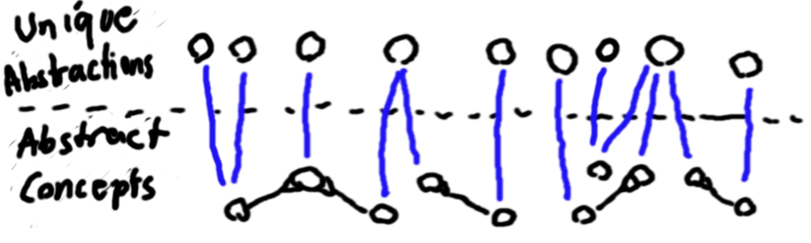

# Joined Concepts

 Within a [conceptlogic](../conceptlogic/conceptlogic.md) there can be [abstract concepts](abstract-concept.md) that represent an usually unknown concept. The abstract concepts can also hold some information about its subject. E.g. how it is connected to other concepts. It is possible, that two abstract concepts represent the same concept. Now the joined concepts are introduced which are usually [variable concepts](variable-and-fixed-concepts.md) : Their task is to group together those abstract concepts which point to the same concepts and are them self abstract concepts pointing to it. In the ideal case different joined concepts always represent different concepts. 

In this example each joined concept is the groups together one to three abstract concepts that are connected with a blue line to the joined concepts. This can be interpreted in a way that the atomic concepts, that are grouped together by the joined concept are abstractions of one single concept. The joined concept can therefore also be seen as abstraction of this single concept. Note that some of the abstract concepts in this example are constructed abstractions.

The algorithm that decides what abstract concepts are joined together has to relay on information that is encoded within the fixed concepts. This can be for example naming or explicit "together" or "separate" information.

In this example abstract concepts are grouped together if they have 
    1) the same name N and are not marked as "separate" or 
    2) if they are marked as "together"