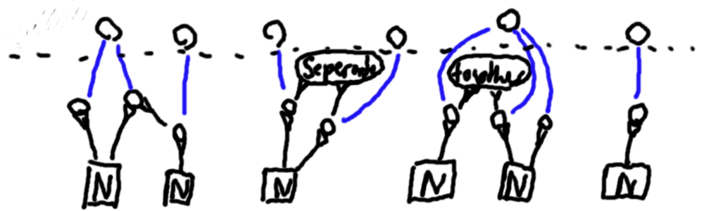

# Unique Abstraction

 Within a [conceptlogic](../conceptlogic/conceptlogic.md) there can be [abstract concepts](abstract-concept.md) that represent an usually unknown concept. The abstract concepts can also hold some information about its subject. E.g. how it is connected to other concepts. It is possible, that two abstract concepts represent the same concept. Now the unique abstractions are introduced which are usually [variable concepts](variable-and-fixed-concepts.md) : Their task is to group together those abstract concepts which point to the same concept and are them self abstract concepts pointing to it. An unique abstraction should indicate, that it represents exactly one and not multiple concepts. Also if there are multiple unique abstraction loaded at the same time it should be clear that each of them is representing a different concept.

In this example each unique concept groups together one to three abstract concepts that are connected with a blue line to the unique concepts. In some cases where an abstract concepts is ambiguous about the concept that it represents there can be more then one unique concept for each abstract concept.

The algorithm that decides what abstract concepts are joined together has to relay on information that is encoded within the semantic network. This can be for example naming or explicit "together" or "separate" information.

In this example abstract concepts are grouped together if they have 
    1) the same name N and are not marked as "separate" or 
    2) if they are marked as "together"