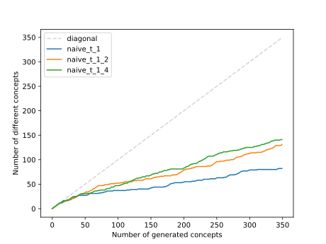
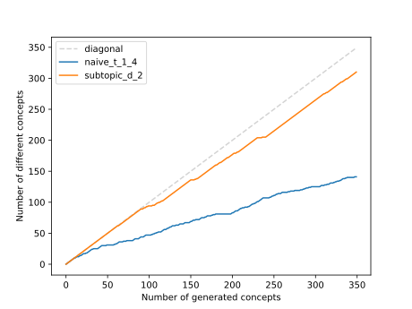

# Create a list of physics terms using llms

The question arises if there is any more scalable and automatable way of creating a list of physics terms then extracting the Wikipedia topics. It seams plausible to use large language models for this task. The naive approach is to ask the modle repeatedly to create a list of terms that belong to subtopics of physics. This approach was tested on the ```gpt-4-turbo```model with the following prompt:

```
The concepts "Stellar evolution", "Brownian motion", "Center of mass" and "Optics" are all part of the topic "Physics".

Give me a selection of 10 specific concepts that belong to subtopics of the topic "Physics".

Return them in a list formatted as ["concept1", "concept2", ...]. Return nothing but the list.
```

This generates physic terms such as:

```
"Condensed Matter Physics","Quantum entanglement","Higgs boson", "Hooke's Law", "Photonics", "Fluid dynamics", "Angular momentum"
```

The problem with this approach is, that ```gpt-4-turbo``` tends to return the same terms when asked repetitively. After 35 Iterations the term "Superconductivity" was returned 30 times, the term "Thermodynamics" was returned 26 times and the term "Black holes" was returned 21 times. This effect can be mitigated by rising the temperature value of the ```gpt-4-turbo``` model, which indicates how much the generated results are subject to chance. After rising the temperature from 1 to 1.4 the most frequently returned values after 35 Iterations are now "Superconductivity" with 25 occurrences , "Thermodynamics" with 18 occurrences and "Nuclear fusion" with 18 occurrences. The plot below shows the number of different concepts dependent on the number of generated concepts for the different temperatures 1, 1.2 and 1.4.


In all three cases the curve raises depending on the concepts generated. The efficiency gets better for higher temperatures but it is still not very high.

An other approach of generating new physics terms. Is to first generate a subtopic tree like described in [subtopic-tree-comparison](../evaluation/subtopic-tree-comparison.md). The model is then asked to generate physics terms that belong to randomly selected branches of this subtopic tree at a given depth. The plot below compares the new approach with the best performing naive approach.


One can see that the subtopic tree approach is much more efficient than the naive approach. However, the generated physic terms are much more specific. The generated terms get more specific if they are selected deeper within the subtopic tree. 

Here are some example terms selected from a depth of 2 in the subtopic tree:

```
"Atmospheric neutrinos", "Kerr metric", "Fission", "Neutron capture", "Magnetic resonance", Hadronization", "Multiverse Theory", "Cosmological Redshift"
```

Here are some example terms selected from a depth of 4 in the subtopic tree:
```
"Galaxy clustering statistics", "Partial Polarization", "Solar wind contributions to dust charging", "Scaling transformations", "Photovoltaic cells", "Quantum entanglement in cosmology", "Half-life of Uranium-238"
```