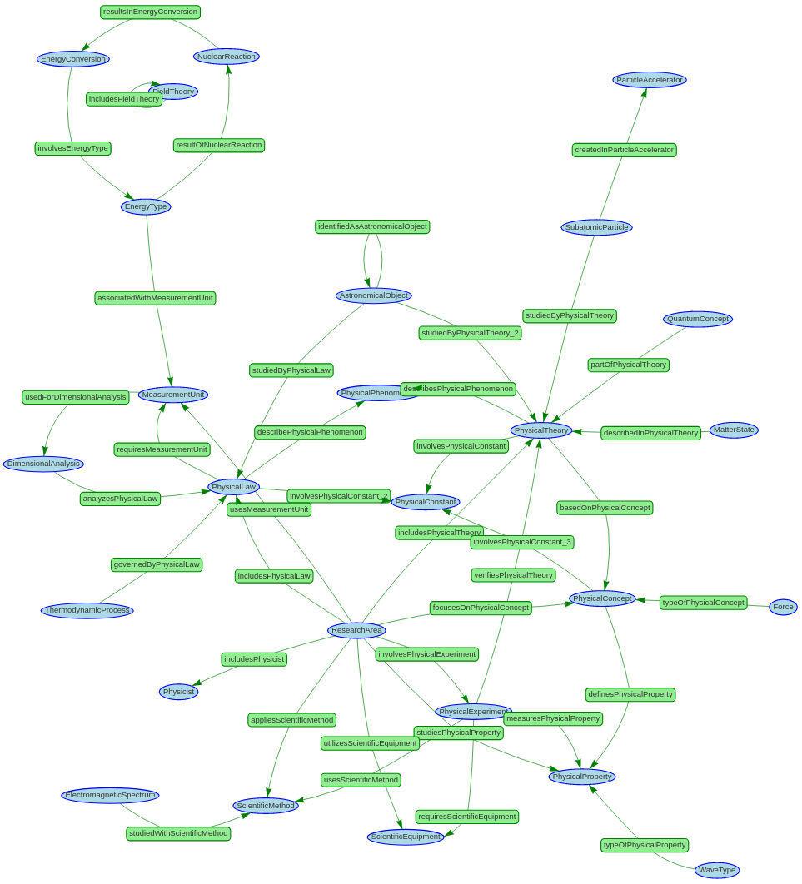

# Generating a physics ontology

Next we want to investigate the question if we can also automate the process of creating an physics ontology with the help of large language models. This is not very trivial because the process of designing appropriate classes and relations is a complex procedure that requires a lot of abstract thinking. However, it is possible to break down the process into smaller steps that can be automated. First we query the language model `gpt-4-turbo` to create a list of classes for the ontology. We do not expect the model to create all classes at once, but we can ask it to extend an existing list of classes with new suggestions in multiple iterations. This raises the quality of the generated classes because the model can concentrate on the classes one by one and use the existing classes as a reference. The following query was used to generate the classes for the ontology:

 ```
 I want to build an ontology about physics.

Therefor I need to create a list of owl classes. I already have the owl classes <list of existing classes>.

What could be 5 additional owl classes that I could use in my ontology?

Return a list of 5 owl classes formatted as follows: ["name of the first class", "name of the second class", ...]

Write the names in camel case and return nothing but this list.
```

  
When we do not seed the list of existing classes, the model generates the following classes:

* QuantumMechanics
* ClassicalMechanics
* Thermodynamics
* Electromagnetism
* ParticlePhysics

This are not good classes for the ontology because they do not define a specific type of concept but only indicate general subject areas. We get a better result when we seed the initial list of classes with a single class to show the model what kind of classes we are looking for.
When we seed the list with the class "ResearchArea" we get the following classes:

 * ResearchArea
* PhysicalTheory
* PhysicalLaw
* PhysicalExperiment
* MeasurementUnit
* PhysicalConcept

These classes are much better because they define specific types of concepts that can be used in the knowledge graph. The process of generaing new classes was repeated multiple times until we had a list of 26 classes that could be used in the ontology.

Next we want to generate the relations between the classes. We can ask the model to generate a list of relations that can be used to connect the classes. The following query was used to generate the relations:

```
I want to build an ontology. I am using the following owl classes: <numbered classes list>.

What relations could exist between instances of these classes?

Return a list of possible relations in the following format:

[[<number of the subject class>, "name of the first relation", <number of the object class>],

[<number of the subject class>, "name of the second relation", <number of the object class>], ... ]

The relation names should be in camel case.

Return nothing but this list.
```

Here is an excerpt of the generated relations:

* ("ResearchArea", "focusesOnPhysicalConcept", "PhysicalConcept")
* ("PhysicalTheory", "involvesPhysicalConstant", "PhysicalConstant")
* ("PhysicalTheory", "describesPhysicalPhenomenon", "PhysicalPhenomenon")
* ("PhysicalExperiment", "requiresScientificEquipment", "ScientificEquipment")
* ("PhysicalExperiment", "verifiesPhysicalTheory", "PhysicalTheory")

The generated relations are valid object properties that can be used to connect the instances of the classes. The process of generating relations was repeated until we had a list of 39 relations that could be used in the ontology. The generated ontology can be seen in the following figure:


The next step is to [generate-knowledge-graph-based-on-an-ontology](generate-knowledge-graph-based-on-an-ontology.md)

[Code (Generation)](https://github.com/gratach/master-experimental/blob/34c4cb27a76982c4047246000ea8f759adeae243/create_physics_ontology.ipynb)
[Code (Visualization)](https://github.com/gratach/master-experimental/blob/34c4cb27a76982c4047246000ea8f759adeae243/visualize_ontology.ipynb)
[Data](https://github.com/gratach/master-database-files/tree/3297b50af30258ec1a86080af3298d9dd4e701ef/master-experimental/generated_ontology/researchAreaSeeded)
