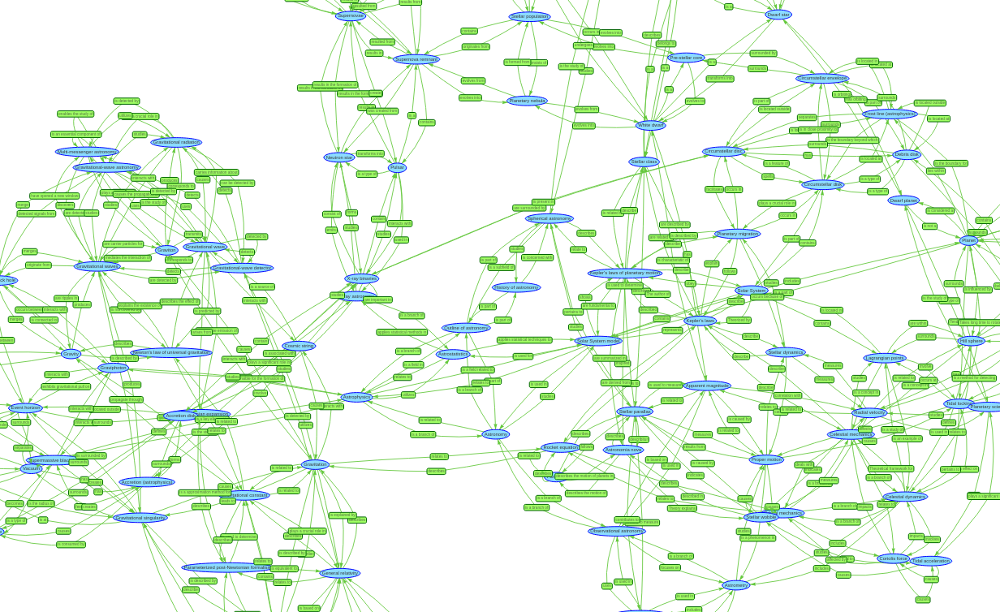
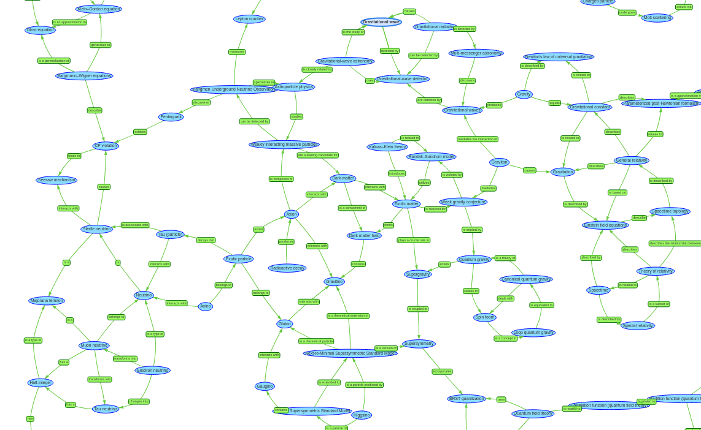
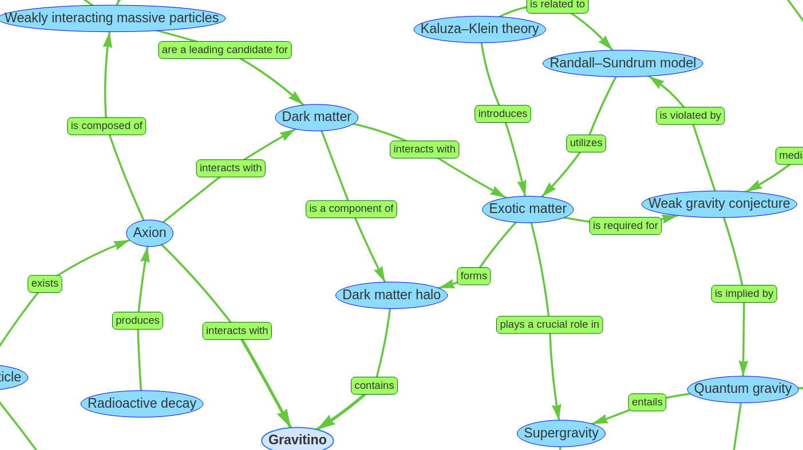

# Mapping a high degree graph to a 2D area

The question arises how it is possible to visualize the generated semantic network in an appropriate way. The semantic triples can be converted into an interactive visual graph using the ```tree.js``` Javascript library. Even though this application is not able to handle the whole dataset of 6494 triples at once, it can visualize small excerpts of 120 nodes just fine. The graphic below shows an excerpt of the ```tri_1``` dataset.



Even if the visualization works, it is not very easy to get an overview of it. The semantic network of the dataset ```tri_1``` has a degree of 6.3 and each edge is connected in both directions. The resulting semantic network is so dense, that it is not possible to visualize it without overlapping edges. To make it easier to understand the content of the semantic network an algorithm has been written that reduces the complexity of the semantic network by leaving out some of the connections. This is done in a way that it becomes now possible to plot the graph without overlapping edges. The algorithm works by internally arranging the nodes in a hexagonal pattern where connected nodes are as close to each other as possible. The algorithm then allows only connections between direct neighbors within the hexagonal pattern. In addition, the double connected edges get replaced by single connected edges. The graphic below shows an excerpt of the ```tri_1``` dataset that was flattened using this algorithm.


This customized view makes it much easier to read and understand the contents of the semantic network, even if some of the information from the original network is missing. The graphic below shows a zoomed in version of the semantic network that focuses on dark and exotic matter.



[Code](https://github.com/gratach/master-adapted-subtopic-tree-generation/blob/65a374f65a1bec8a2a8e9d32636b29f9bc52ef0d/triple_visualization.py)
[Data](https://github.com/gratach/master-database-files/tree/369cd74a6190113413d6befae37a40af26df8b9a/master-adapted-subtopic-tree-generation/triples/tri_1)