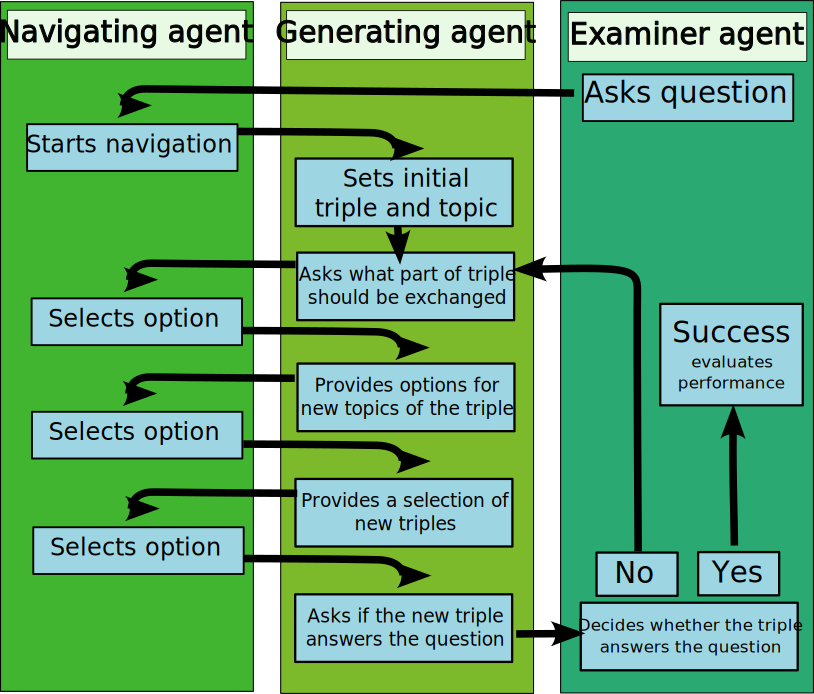

# Navigate semantic triples by finite choices

Next a mechanism should be introduced that can be used to navigate the semantic network by finite choices. This should serve the purpose of providing a method to evaluate the quality of a semantic network by exploring how good an agent is in finding specific information within the knowledge graph. Therefore we use questions, that can be answered by providing a semantic triple. Such questions can be generated by ```gpt-4-turbo```. For example the question "What do particle accelerators produce?" can be answered by the semantic triple ```['Particle accelerators', 'produce', 'High-energy particles']```. 

We now consider a scenario that consists of three AI agents. One generating agent who provides a knowledge base by generating semantic triples. One navigating agent who navigates through the knowledge of the generating agent to find the answer to a question. And finally one examiner agent who asks the questions and decides whether they are answered by the semantic triples. The generating agent and the navigating agent are playing in a team and try to find the correct answer to the question of the examiner agent. Thereby the generating agent who provides the knowledge does not know the question while the navigating agent does know the question but is only allowed to use the knowledge of the generating agent to answer it. The way how both agents can communicate is restricted. The generating agent has to offer the navigating agent a range of options how to continue the navigation through his knowledge and the navigating agent is only allowed to communicate with the generating agent by telling him which of this options he wants to choose. The generating agent is only allowed to provide options that depend on content but not on the language. This should prevent him from asking questions like 
"Should the first letter of the knowledge that you require be
1) an A, 
2) an B, 
3) an C
..." 

The question is now how the generating agent and the navigating agent can be designed that they are efficiently able to find the answer to the provided question with a minimum of chosen options.

We use the following implementation as an approach to answer this question: The searching agent receives the question from the examiner agent and starts the navigation. They are starting with an initial triple and a topic of the initial triple. A navigation iteration is now performed in the following steps: The generating agent asks the searching agent which part of the semantic triple should be changed. In this case a total of six options are available:
1) The subject should be changed
2) The predicate should be changed
3) The object should be changed
1) The subject and the predicate should be changed
2) The predicate and the object should be changed
3) The object and the subject should be changed
The navigating agent chooses from these options.

Next, the topic of the newly generated triple should be adjusted so the generating agent asks the searching agent to chose the new topic from a number of subtopics, similar topics and overarching topics of the current topic.
Finally, the generating agent generates a number of new triples and lets the searching agent choose from that list. The examiner agent decides now if this new triple answers the question and the iteration is repeated if it does not.

The graphic below illustrates the implementation with the tree agents.



The [decision-cost](../equations/decision-cost.md) evaluation method.

The [triple-navigation-evaluation](../evaluation/triple-navigation-evaluation.md)