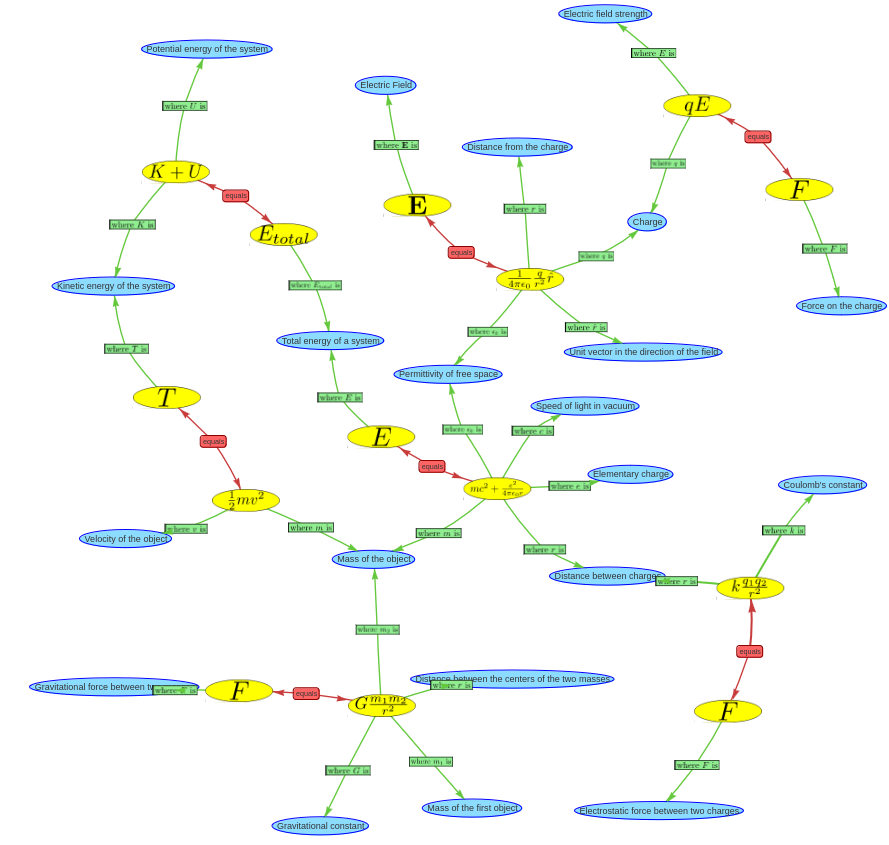

# Generation of networks containing multiple equations

The [previous examples](network-of-equations.md) show isolated equations. Here we are now investigating whether it is also possible to generate networks that contain multiple equations. Therefore an algorithm is used that starts with a physics term like "Elementary charge" and asks the LLM to return a randomly selected physics formula that contains a symbol with this explanation.  In the next step one of the explanation terms of the returned formula is chosen and the LLM is asked to generate a formula that contains this new term as explanation. This procedure is repeated and identical formula explanation terms are merged.

The graphic below shows a formula network that was generated in this way:

This network combines equations from different topics like gravitational force, Coulomb force and kinetic energy and combines them into one graph that is joined by common quantities like mass and energy. This demonstrates that in general, the LLM is able to generate interdisciplinary equation networks, even if previous results have shown that the equations are not always completely reliable.

[Data](https://github.com/gratach/master-database-files/blob/31f0828ea9a129917ac5348b1b3a67bd66c4e409/master-experimental/equation_networks/formula_network.html)
[Code](https://github.com/gratach/master-experimental/blob/b273efd27f0cdbb29cea39cc28abde20be5bef1e/equation_networks.ipynb)

.