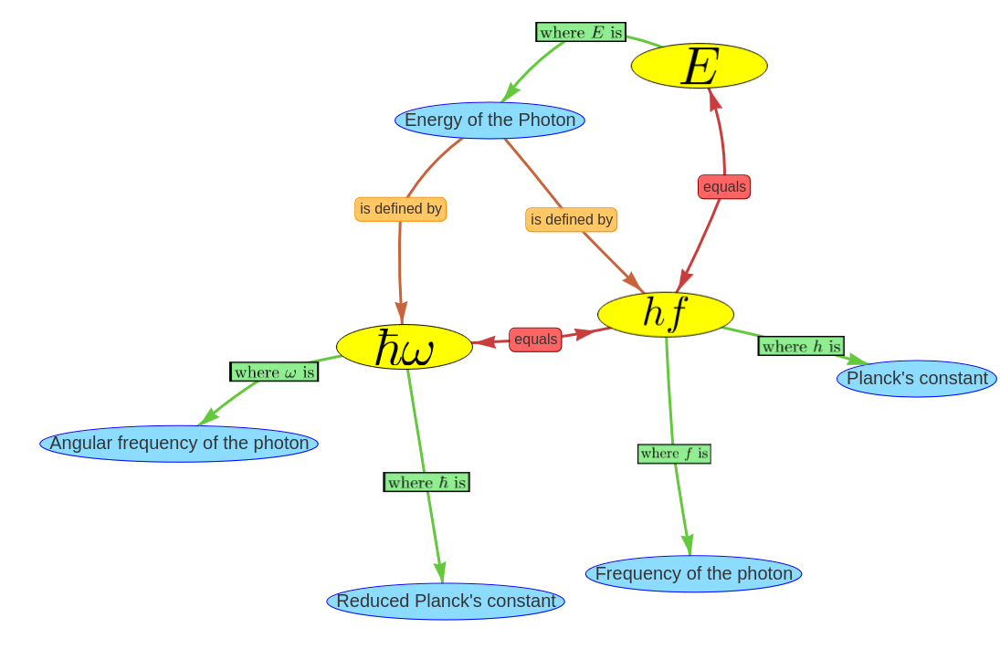
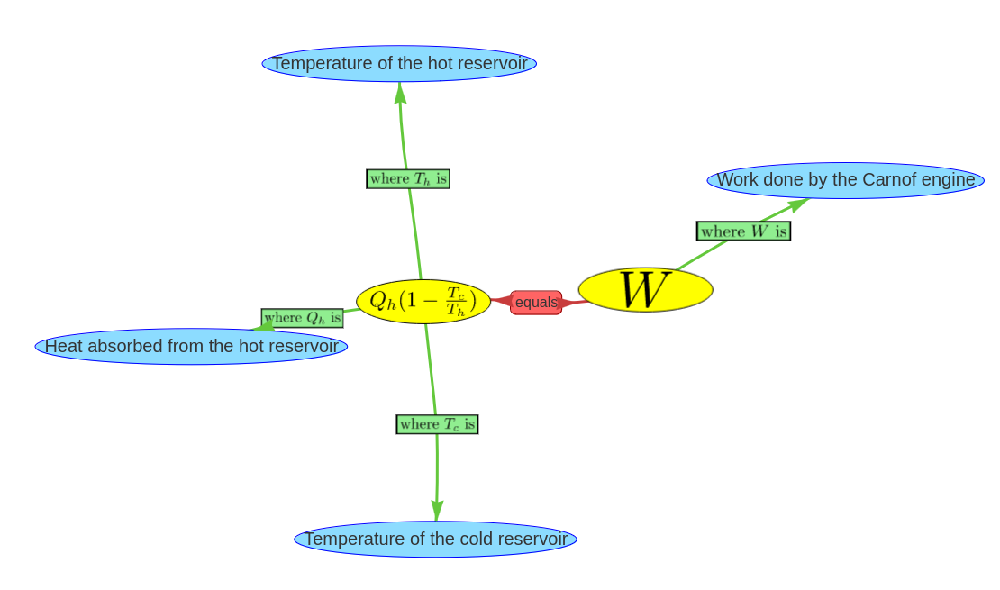
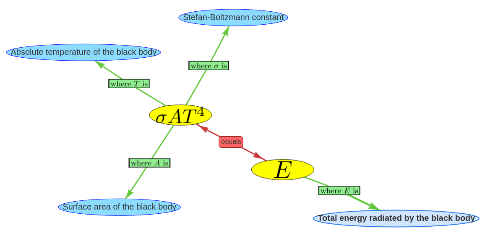

# Physics formula network

A semantic network of physic terms, that are connected by natural language expressions as discussed in [[manual-triple-evaluation]] can be a powerful knowledge representation framework. However, some aspects of physics are usually represented in the form of formulas. Even if there are approaches to represent even complicated formulas as natural language ([source](http://islab.donga.ac.kr/Information/aece_ys.pdf)) it is more convenient for humans to read them represented by mathematical symbols.

In order to take this fact into account when designing the semantic network, an ontology is proposed that incorporates formulas as nodes into the network. The graphic below shows an example of the Planck relation displayed as knowledge graph.

The ontology allows two types of nodes: Natural language concepts such as "Energy of the Photon" and mathematical terms such as "$\hbar \omega$". For this two types of nodes two relations are possible. 
* The ```equals"``` relation that can connect two mathematical terms with each other and indicates the equality between them.
* The ```"where <symbol> is"``` relation wich indicates that a specific symbol of the formula is representing the connected natural language concept. 

## Technical realization of using formulas in semantic networks

Handling formulas in semantic networks is not completely trivial because the software tools that handle network data often support only plain ```utf-8``` text. To represent the formula internally as bytes the latex syntax was used together with a marker that indicates, that the byte sequence should be interpreted as formula. For example the formula $E = \hbar \omega$ would be handled as ```"f: E = \hbar \omega"```. 
For the visualization of the example above the tool ```vis.js``` was used that can display interactive graphs in the web browser. This tool does not support inline formulas. The solution for this problem was to convert the formula into ```svg``` using the python library ```latextools``` This ```svg``` graphics could then be included into the ```vis.js```visualization.

## Generating formula networks with large language models

The question arises if it is also possible to use large language models to generate such formula networks for a specific physics topic. This would open up many possibilities to automatically generate physics knowledge with a stronger mathematical focus. Here, we use the approach to give the LLM an example how a latex formula with the corresponding symbol explanations should look like and ask it to create an equally formatted formula for a specific physics topic.

Query: 
```
Example of a formula for the Energy of a Photon: 
[
	"$E = \\hbar \\omega$ = h f", 
	{
		"$E$": "Energy of the Photon", 
		"$\\hbar$": "Reduced Planck\'s constant", 
		"$\\omega$": "Angular frequency of the photon", 
		"$h$": "Planck\'s constant", 
		"$f$": "Frequency of the photon"
	}
]

give me a formula for ??? with the explanations of all symbols formatted in the same way. The explanations of the symbols should be concepts written in a compact form. Return nothing but the result [formula, symbol explanations]
```

In this query the ??? would be replaced by an physics topic that should be displayed as formula network. The answer of this query must then be broken down into its components. This is done by using the python json parser. The formula must be split up at the equals sign into its expressions. Next, an algorithm tailored to the Latex syntax must determine which of the explained symbols appear in which expressions. It is not enough to just search for the latex string of the symbol in the expression because this would lead to false positiv results. For example in the formula for the acceleration ```a = \frac{\Delta v}{\Delta t}``` a appears only on the left side of the formula but would be found also in the right side of the formula by a naive algorithm that interprets the a in "\frac" as the symbol for acceleration. The solution approach that is used here may not detect all corner cases correctly but works for the most commonly used formula signs.

The implemented program is able to generate formula networks. This example shows a formula network that is generated for the topic "Work done by a Carnot engine" by ```gpt-4-turbo```:


This is the correct formula for the ideal Carnot engine. But this example also shows, that ```gpt-4-turbo``` is not always perfectly reliable. It made a typo in the explanation of $W$ and wrote *Carnof engine* instead of *Carnot engine*.

Not all the generated formulas of ```gpt-4-turbo``` are correct. Here is an example of a false formula:


The task was to generate a formula for the energy radiated by a black body. The created formula is incorrect because the expression $\sigma A T^4$ is actually not equal to the energy $E$ but to the radiated power $\phi$. The correct formula would be  $\sigma A T^4 t = E$ where $t$ is the time span for that the radiated energy of the black body is measured. 

[Source code](https://github.com/gratach/master-experimental/blob/21ba21b58a6b71e6c38512374c9fcb9673646626/visjs_svg_formula.ipynb)