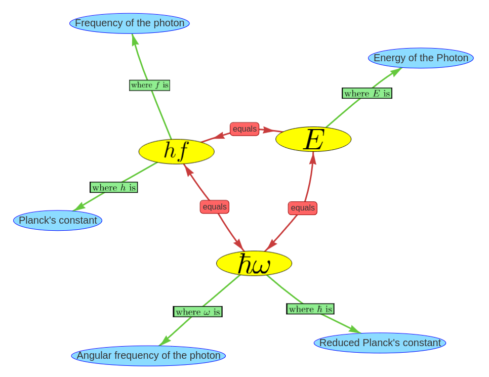

# Physics formula network

A semantic network of physic terms, that are connected by natural language expressions as discussed in [[manual-triple-evaluation]] can be a powerful knowledge representation framework. However, some aspects of physics are usually represented in the form of formulas. Even if there are approaches to represent even complicated formulas as natural language ([source](http://islab.donga.ac.kr/Information/aece_ys.pdf)) it is more convenient for humans to read them represented by mathematical symbols.

In order to take this fact into account when designing the semantic network, an ontology is proposed that incorporates formulas as nodes into the network. The graphic below shows an example of the Planck relation displayed as knowledge graph.

The ontology allows two types of nodes: Natural language concepts such as "Energy of the Photon" and mathematical terms such as "$\hbar \omega$". For this two types of nodes three relations are possible. 
* The ```equals"``` relation that can connect two mathematical terms with each other and indicates the equality between them.
* The ```"is defined by"``` relation that connects a natural language concept with a mathematical term and shows that the concepts value can be calculated with this formula.
* The ```"where <symbol> is"``` relation wich indicates that a specific symbol of the formula is representing the connected natural language concept. 

## Technical realization of using formulas in semantic networks

Handling formulas in semantic networks is not completely trivial because the software tools that handle network data often support only plain ```utf-8``` text. To represent the formula internally as bytes the latex syntax was used together with a marker that indicates, that the byte sequence should be interpreted as formula. For example the formula $E = \hbar \omega$ would be handled as ```"f: E = \hbar \omega"```. 
For the visualization of the example above the tool ```vis.js``` was used that can display interactive graphs in the web browser. This tool does not support inline formulas. The solution for this problem was to convert the formula into ```svg``` using the python library ```latextools``` This ```svg``` graphics could then be included into the ```vis.js```visualization.

[Source code](https://github.com/gratach/master-experimental/blob/21ba21b58a6b71e6c38512374c9fcb9673646626/visjs_svg_formula.ipynb)