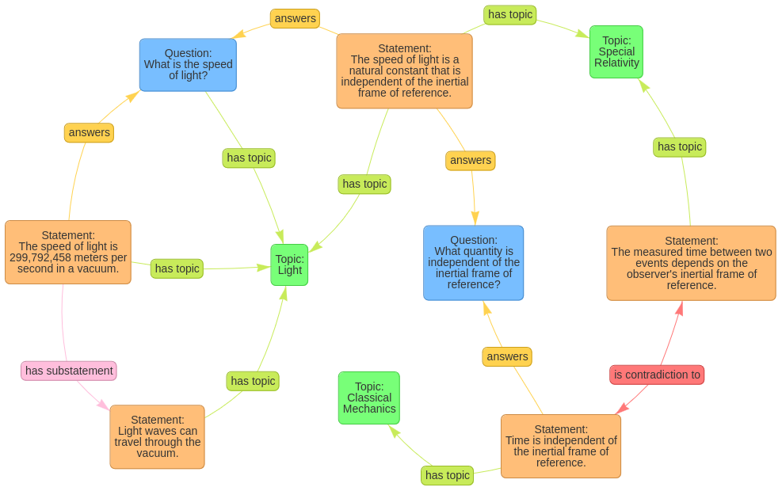

# Semantic network of questions and answers

We now want to analyze the possibility of building a semantic network of physics questions and answers. This network should contain three types of nodes: questions, statements and topics. Questions can be answered by statements, which is indicated by the relation `answers`. Statements can support each other or contradict each other, which is indicated by the relation `supports` or `is contradiction to`. They also can contain other statements as substatements, which is indicated by the relation `has substatement`. Both statements and questions can be related to topics, which is indicated by the relation `has topic`. Statements can be ether true or false. This information is not included in the network, but has to be determined by the external observer. The following figure shows an example of such a network:

[generating-networks-of-questions-and-answers](generating-networks-of-questions-and-answers.md)

[Code](https://github.com/gratach/master-experimental/blob/ea52c7afd1a44aafdcbf8db627a7100b03d0498d/building_a_semantic_network_of_questions_and_answers.ipynb)
[Data](https://github.com/gratach/master-database-files/blob/c86dcfde26da5734ec5cd24a981c2960e378d26d/master-experimental/building_a_semantic_network_of_questions_and_answers/light.html)
