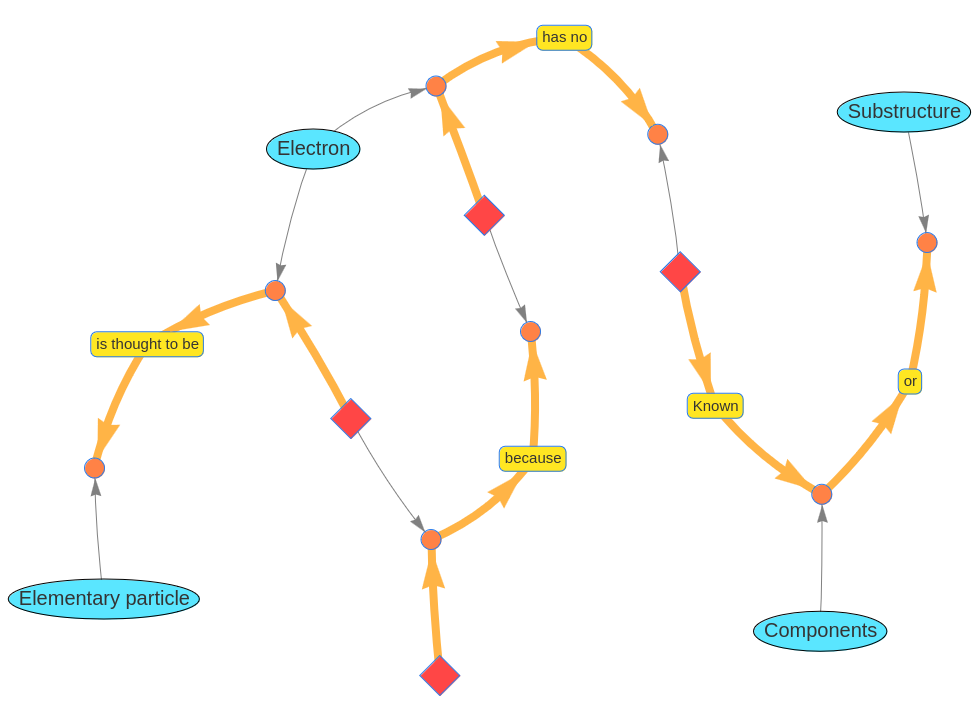
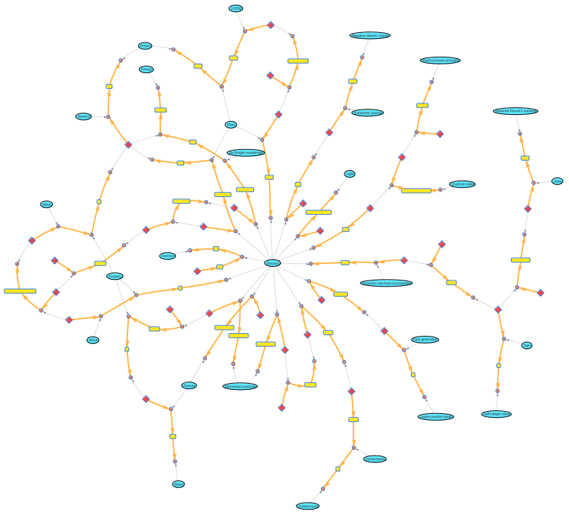
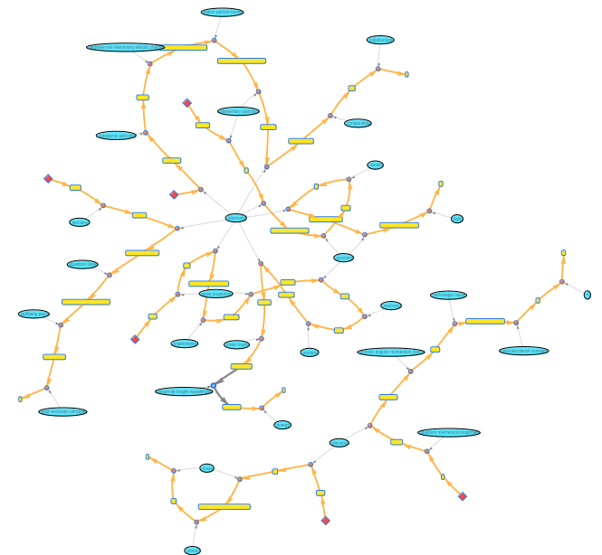

# Semantic network of sentences

Natural language is a complex and expressive construct that is able to represent even detailed and complicated information. This pushes the representation possibilities of a semantic network that consists only of triplets to its limits. Some sentences can not be expressed in a nice way by purely using semantic triples. An example is the sentence:

```A electron is thought to be elementary particles because it has no known components or substructure.```

This can be disassembled into the triples ```["Electron", "is thought to be", "Elementary particle"]``` and ```["Electron", "has no known", "Substructure"]``` but the causality between those two statements can not be expressed within the scope of this semantic semantic network design.

A solution for this problem is to use a semantic network design, that is more adapted to the structure of natural language. This design for a semantic network of sentences uses a more complex structure for representing physics knowledge. The graphic below illustrates how the sentence from above would be depicted in such network.

The network consists of four concepts, illustrated by blue ellipses, and four word structures, illustrated by a red diamond shape followed by a tail of orange arrows. This orange tail can be understood as a natural language sentence (or a part of it) that is read in the order indicated by the direction of the orange arrows. These sentences consist of text compounds, depicted by yellow boxes, and concept placeholders that are depicted by the little orange circles. A gray arrow points from each concepts to the concept placeholders within the word structures where the concepts have to be inserted. The concept placeholders can not only be a placeholder for those concepts that are depicted by the blue ellipses but also for those concepts that are represented by other word structures.

The leftmost word structure in the graphic represents the sub sentence "Electron is thought to be elementary particle" The topmost and rightmost word structures in the graphic state together that "Electrons have no known components or substructure" and the bottom most word structure tells the causality between those two statements.

The graphic below shows the first paragraph of the Wikipedia article about electrons converted into a sentence network. The highly connected node in the center is the concept "Electron". The conversion from the plain text to the sentence network was done manually.



The resulting network is able to store most nuances of the used text. It also extracts all concepts that occur in the text and links them with each other. The approach is scalable but requires a lot of curation work. The main challenge is it to link cross references between sentences and disassemble the sentences in their atomic parts.

[code](https://github.com/gratach/master-experimental/blob/fe292da66c71d86032288a259a474089b8d28ce7/sentence_networks.ipynb)
[data](https://github.com/gratach/master-database-files/tree/85923aa26df2e6c154b7bab7f9418bb798bd3916/master-experimental/sentence_networks)
### Automating the construction of the sentence network

After doing the creation of the semantic sentence network manually, an attempt was made to automate the process of converting a given text into this format. For this purpose a pipeline was built that starts with the plain text and splits it into sentences using the natural language toolkit Python package. Next, the coreferences within the sentences get resolved by asking the LLM to replace all occurrences of references like "it" or "this"  by the actual words that are referenced by them. Finally the LLM is asked to mark the concepts within the resolved sentences, which are than isolated from the rest of the sentences by using a python algorithm. This information is then used to build the sentence network.

For testing this approach the same paragraph was used that was also used for the manual creation. The resulting graph that is shown below is not completely connected. This is due to the algorithm distinguishing between the concepts "Electron" and "Electrons"



There are also some limitations of the chosen conversion algorithm. While the manual construction of the sentence network units of meanings could be identified and isolated also within sentences, such fine grained resolution is not possible with the automated approach. Instead every sentence produces exactly one word structure. Also this algorithm does match concepts as equal when they are represented by the same string. Synonyms or identical words that describe different things will not be taken into account accordingly.

[data](https://github.com/gratach/master-database-files/tree/0aa58c96d11212d5dcdfb46d77e70daec90a97ab/master-experimental/split_sentences)
[code](https://github.com/gratach/master-experimental/blob/b2d45c4ab16e058091a868f2539ff3e02c6bec27/split_senteces.ipynb)

