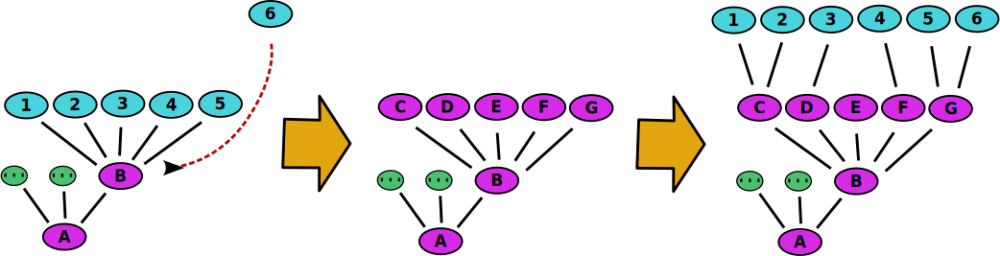
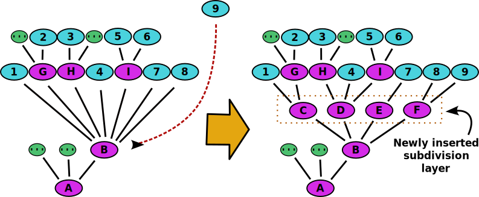

# Subtopic tree algorithms description

We now want to focus on the creation of a subtopic tree of physics. To make sure that our subtopic tree captures all relevant subtopics of physics, we want to use the list of 1038 physics terms that we extracted from the Wikipedia articles. Our requirement is that the subtopic tree should contain all of these terms as leaf nodes. There are multiple ways to create a subtopic tree. It can be done manually by a human expert or automatically by a machine learning model. We want to focus on the automatic creation of a subtopic tree because it also allows us to investigate the ability of large language models to structure and represent physics in an organized manner. While a small subtopic tree can be potentially created with a single prompt to a large language model like `gpt-3.5-turbo`, a larger subtopic tree requires a more sophisticated approach. We now want to discuss two different algorithmic approaches to create a subtopic tree of physics.

The first approach we call the free association algorithm. It is based on the idea that the large language model freely associates the subtopics of a given topic without considering the physics terms that should be structured. It starts with a empty tree that only contains the root node "Physics". From that point onwards the following steps are repeated: A new physics term from the list is inserted into the tree. This is done by starting from the root node and repeatedly selecting the child junction node with the topic that is most likely to contain the new physics term. The search continues until there are no further child junction nodes.If the selected junction node has less than a given maximum number of child leaf nodes, the new physics term is inserted as a leaf node. If the selected junction node has already the maximum number of child leaf nodes, a selection of new, freely associated child junction nodes is generated by asking the large language model to create a list of subtopics that belong to the topic of the selected junction node. The leaf nodes of the selected junction node are then distributed among the new child junction nodes by selecting the child junction node that is most likely to contain the leaf node.

The second scenario is illustrated in the following graphic:

  

In this example the leaf nodes are colored in turquoise and the junction nodes are colored in purple. The green node with the triple dots symbolizes an arbitrary number of further child nodes. The threshold for the maximum number of child leaf nodes is set to 5 in this example. When the leaf node 6 is inserted at the junction node B the mechanism is triggered to create the new junction nodes C, D, E and F. The leaf nodes 1 - 6 are then distributed among the new junction nodes.
 

The second approach we call the subdivision algorithm. It is based on the idea that the large language model subdivides the subtopics of a given topic into more specific subtopics. In contrast to the free association algorithm, the subdivision algorithm does not only insert new junction nodes at the ends of the branches of the tree but also in the middle. Again, the algorithm starts with a empty tree that only contains the root node "Physics". From that point on the following steps are repeated: A new physics term from the list is inserted into the tree. This is done by starting from the root node and repeatedly selecting the child junction node with the topic that is most likely to contain the new physics term. This algorithm also allows the option that none of the child junction nodes is selected. In this case the search ends at the current junction node. Again, two scenarios are possible: If the selected junction node has less than a given maximum number of child nodes, the new physics term is inserted as a leaf node. If the selected junction node has already the maximum number of child nodes, a number of new child junction nodes is generated by asking the large language model to subdivide the child nodes of the selected junction node into more specific subtopics. These new child junction nodes are then inserted as an intermediate layer between the selected junction node and its child nodes. The second scenario is illustrated in the following graphic:

  

In this example a new leaf node 9 is inserted at the junction node B. This junction node has already the maximum number of 7 child nodes. The new junction nodes C, D, E and F are generated by subdividing the child nodes of the junction node B.

