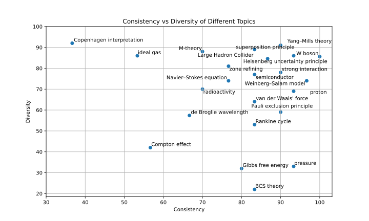

# Checking the knowledge consistency of large language models

After building a semantic network of physics questions and answers, we can use the principle of questions and answers that are assigned to specific topics to test the consistency of the physics knowledge of large language models. We want to use this to evaluate how much contradictions are contained in the knowledge about different physics terms. For this, we use an excerpt of 100 significant terms from the oxford dictionary list of physics terms. For each of this terms we ask `gpt-3.5-turbo` to generate a list of 30 questions about this term. In the next step we ask `gpt-3.5-turbo` to provide a list of 5 answers to each of these questions. One of these answers should be correct and the other four should be wrong. However, they should all sound plausible to the layman. We then ask `gpt-3.5-turbo` to identify the correct answer to each question. If the model is able to do this with a high accuracy, we can assume that the knowledge about this term is consistent.  

As a result, we obtain the list of physics terms with the percentage of correct answers that `gpt-3.5-turbo` was able to identify. 

The five terms with the ==highest percentage of correct answers== are: `active galactic nucleus` (100%), `Archimedes' principle` (100%), `Heisenberg uncertainty principle` (100%), `Newton's law of gravitation` (97%) and `Higgs boson` (97%). 

The five terms with the ==lowest percentage of correct answers== are: `Copenhagen interpretation` (37%), `ideal gas` (53%),  `Compton effect` (57%), `relativistic mass` (60%) and `de Broglie wavelength` (67%). Note that the statistical error of this evaluation is up to 9%.

It is interesting to note that the term `Copenhagen interpretation` with the lowest percentage of correct answers is closely related to the term `Heisenberg uncertainty principle` with one of the highest percentage of correct answers. This might be due to the fact that the Heisenberg uncertainty principle is a well defined mathematical concept, while the Copenhagen interpretation is a more philosophical concept that might be interpreted in different ways. In addition, the Copenhagen interpretation is a collective term for a number of different interpretations of quantum mechanics, which might lead to contradictions in the answers.

The term \textit{ideal gas} with a low percentage of correct answers is also interesting, as it is a well defined concept in classical physics. The main problem here seems to be, that the model is not sure whether the particles in an ideal gas are interacting or not. This is a typical example of a contradiction in the knowledge of the model, that might be due to the fact that this contradiction also appears in the training data. For example the german wikipedia article about the ideal gas states that there can be elastic collisions between the particles , while the english wikipedia article states that the particles are not subject to interparticle interactions eaven if this requirement of zero interactions can often be relaxed. The possibility of elastic collisions between the particle also seems to be a contradiction to the fact that the particles are assumed to be point like with no volume and therefore have an infinitely small cross section. On the other hand the possibility of elastic collisions is compatible with most of the derived properties of the ideal gas, such as the ideal gas law, so it would make sense to include it in the definition of the ideal gas.  

In the case of the term `Compton effect` the model seems to have problems to decide weather the wavelength of the scattered photon is longer or shorter than the wavelength of the incident photon. This ambiguity is not due to unclear definitions in the training data, but seems to be a general problem of the model to understand the Compton effect. The Compton effect describes the scattering of a photon by a charged particle, which leads to a change in the wavelength of the photon. In the case of the charged particle being at rest before the scattering, the wavelength of the scattered photon is longer than the wavelength of the incident photon because the photon loses energy to the charged particle. Only if the charged particle is moving towards the incident photon, the wavelength of the scattered photon can get shorter than the wavelength of the incident photon. It seems that `gpt-3.5-turbo` is confused by this fact and therefore gives contradictory answers to questions about the Compton effect.

Besides te consistency of the knowledge about the terms, we can also analyze the diversity of the knowledge about the terms. Therefore we assume that if the model has much detailed knowledge about a term, it should be able to generate a large variety of diverse questions about this term. On the other hand, if the model has only a superficial knowledge about a term, all questions about this term should be very similar. We can ask `gpt-3.5-turbo` determine the diversity of the 30 questions about each term by letting it assign a diversity score to the questions. This score should range from 0 to 100, where 0 means that all questions are identical and 100 means that all questions are completely different. For more consistant results we ask the model five times and take the average of the diversity scores.  

The five terms with the ==highest diversity of questions== are: `Copenhagen interpretation` (92), `conservation law` (91), `uncertainty principle` (91), `Yang–Mills theory` (91) and `big-bang theory` (90). 

The five terms with the ==lowest diversity of questions== are: `BCS theory` (22), `Gibbs free energy` (32), `pressure` (33), `Higgs boson` (33) and `Compton effect` (42).

The term with the lowest diversity of questions `BCS theory` is a complex theory in the field of condensed matter physics. Most of the questions about this term are about the basic principles of the theory, such as the formation of Cooper pairs and the superconducting state. A typical question about the BCS theory is: "What is the BCS theory and how does it explain superconductivity?". This question is very similar to many other questions about the BCS theory, which leads to a low diversity score.

The term with the highest diversity of questions `Copenhagen interpretation` is at the same time the term with the lowest percentage of correct answers. It seems that the model has a lot of different ideas about the Copenhagen interpretation, which leads to a high diversity of questions. Typical question about the Copenhagen interpretation are: "What is the Copenhagen interpretation and how does it explain the behavior of subatomic particles?" and "What is the role of the observer in the Copenhagen interpretation of quantum mechanics?"

[Code](https://github.com/gratach/master-experimental/blob/5beaef388417215c6fcec96af54432a444922289/questions_about_topics.ipynb)
[Data](https://github.com/gratach/master-database-files/tree/b22927736eeea431ca64e6540dd2b69ead1f7838/master-experimental/questions_about_topics)