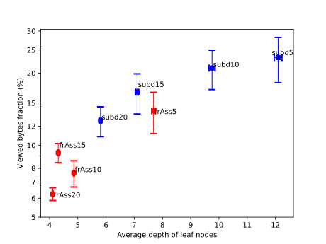

# Comparison of frAss and subd for different parameters

The viewed bytes fraction plotted against the average depth of the leaf nodes for different parameter settings of the subdivision algorithm (blue) and the free association algorithm (red). The y axis is shown with logarithmic scaling.

| Tree    | Average term depth | Average number of sub-junction-nodes per junction node with sub-junction-nodes | Average viewed nodes fraction | Average viewed bytes fraction | Average choice correctness percentage |
| ------- | ------------------ | ------------------------------------------------------------------------------ | ----------------------------- | ----------------------------- | ------------------------------------- |
| frAss5  | 7.684 ± 0.0668     | 4.9809 ± 0.0191                                                                | 13.05 ± 2.55%                 | 13.89 ± 2.73%                 | 82.99 ± 1.79%                         |
| frAss10 | 4.8593 ± 0.02      | 9.833 ± 0.167                                                                  | 7.697 ± 0.962%                | 7.642 ± 0.962%                | 76.62 ± 2.99%                         |
| frAss15 | 4.3064 ± 0.0176    | 14.481 ± 0.519                                                                 | 10.189 ± 0.929%               | 9.295 ± 0.855%                | 74.36 ± 2.47%                         |
| frAss20 | 4.1108 ± 0.0172    | 19.1 ± 0.954                                                                   | 6.425 ± 0.388%                | 6.25 ± 0.383%                 | 88.94 ± 2.13%                         |
| subd5   | 12.097 ± 0.135     | 2.2508 ± 0.0702                                                                | 20.52 ± 4.36%                 | 23.22 ± 4.98%                 | 79.01 ± 1.43%                         |
| subd10  | 9.756 ± 0.108      | 3.036 ± 0.16                                                                   | 18.49 ± 3.46%                 | 21 ± 3.92%                    | 63.33 ± 2.23%                         |
| subd15  | 7.1002 ± 0.0489    | 3.492 ± 0.235                                                                  | 13.59 ± 2.59%                 | 16.68 ± 3.18%                 | 77.74 ± 2.3%                          |
| subd20  | 5.8054 ± 0.0353    | 4.846 ± 0.315                                                                  | 12.4 ± 1.74%                  | 12.66 ± 1.81%                 | 80.38 ± 2.23%                         |

This is a more systematic comparison of both algorithms then the previous evaluation of the [subdivision algorithm](physics-term-adapted-subtopic-tree-evaluation.md) and the [free association algorithm](physics-term-adapted-subtopic-tree-evaluation-free-association-algorithm.md).

[Code](https://github.com/gratach/master-experimental/blob/88cf9e8b0a2199432e67d25f51bcef9419164e13/subtopic_tree_comparison.ipynb)
[Data](https://github.com/gratach/master-database-files/tree/cc4aeabad3fa67978c5391b0a46281985d8a5b2d/master-experimental/subtopic_tree_comparison) [Data-2](https://github.com/gratach/master-database-files/tree/cc4aeabad3fa67978c5391b0a46281985d8a5b2d/master-adapted-subtopic-tree-generation/trees)
