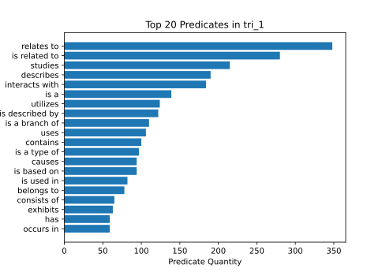

# Correlated triples evaluation

The triples were generated by finding a predicate for the pairs of [correlated physics terms](physics-term-correlation-network-evaluation.md). This is the evaluation of the dataset ```tri_1``` which was generated from the correlated physics terms dataset ```tree_cor_mi_man```.

There is a total of ===6494 triples=== in the database. Here is an excerpt of 10 randomly selected triples from the database:

```
["Impulse (physics)", "is related to", "Elasticity (physics)"],
["Curvaton", "drives", "Cosmic inflation"],
["Spectroscope", "uses", "Pinhole camera"],
["Quantum nonlocality", "relates to", "Quantum dynamics"],
["General relativity", "describes", "Spacetime topology"],
["Bose gas", "is equivalent to", "Fermi gas"],
["Chern class", "is related to", "Gauge symmetry"],
["Circumstellar envelope", "is located at", "Frost line (astrophysics)"],
["Cosmological constant", "relates to", "Vacuum energy"],
["Gravitation", "leads to", "Gravitational singularity"],
```
Of this 10 examples the triple ```["Bose gas", "is equivalent to", "Fermi gas"]``` is clearly false. Others like ```["Curvaton", "drives", "Cosmic inflation"]``` and ```["Spectroscope", "uses", "Pinhole camera"]``` are not generally true but could be considered correct if you take an specific cosmic inflation theory or a specific realization of a spectroscope for which the statement applies. The triples ```["Impulse (physics)", "is related to", "Elasticity (physics)"]```,  ```["Quantum nonlocality", "relates to", "Quantum dynamics"]``` and```["Chern class", "is related to", "Gauge symmetry"]``` are very unspecific but can not be considered as false. The triple ```["Circumstellar envelope", "is located at", "Frost line (astrophysics)"]```is to specific because the circumstellar envelope is to large to be located at a specific place. The triples ```["General relativity", "describes", "Spacetime topology"]```,  ```["Cosmological constant", "relates to", "Vacuum energy"]``` and ```["Gravitation", "leads to", "Gravitational singularity"]``` can be considered as true and meaningful.


The most used predicates are plotted in the following bar graph:


The generated triples were classified into the tree categories "true", "false" and "not understandable" ```by gpt-3.5-turbo```. The result is:

| Category           | Percentage of total triples |
| ------------------ | --------------------------- |
| true               | 48%                         |
| false              | 26%                         |
| Not understandable | 26%                         |
Here are five randomly picked examples for each of these categories:

True:
```
["Equilibrium thermodynamics", "is a branch of", "Classical thermodynamics"],
["Wave function collapse", "is caused by", "Von Neumann-Wigner interpretation"],
["Gravitational radiation", "causes the propagation of", "Gravitational waves"],["Ferromagnet", "exhibits", "Spontaneous magnetization"],
["Beta decay", "results in", "Exponential decay"]
```
False:
```
["Macroscopic quantum phenomena", "can be observed in", "High temperature superconductor"],
["Quark model", "is composed of", "Bottom quark"],
["Heat exchanger", "transfers heat to", "Thermal wheel"],
["Clusters of galaxies", "is part of", "Galaxy filament"],
["Electron hole", "is described by", "Drude model"],
```
Not understandable:
```
["Pentaquark", "contains", "Pionium"],
["Laser", "emits", "Light-emitting diode"],
["Stellar structure", "describes", "Initial mass function"],
["Quantum electrodynamics", "is a solution to", "Maxwell's equations"],
["Cosmic ray", "has", "Weak isospin"],
```
The classification into this three categories by ```gpt-3.5-turbo``` has no very good quality. The triple ```["Wave function collapse", "is caused by", "Von Neumann-Wigner interpretation"]``` which was categorized as true is clearly not true because the interpretation does not cause the collapse. On the other hand the triple ```["Clusters of galaxies", "is part of", "Galaxy filament"]``` which was classified as false is indeed true. The example triples of the "not understandable" category are all understandable (even if not true for the most part). This category was meant for the relatively rare triples like ```["Motion", "Tangential speed", "Tangential speed"]``` which can not be assigned with an truth value because they do not make sense. This triple was classified by ```gpt-3.5-turbo``` in the "false" category.

Because the quality of the automatic evaluation of the triples truth is not reliable a [[manual-triple-evaluation]] is necessary.

To ==measure the ambiguity== and also the quality of the created predicates the [[false-choices-per-correct-choice-compared-to-random]] metric is used. For this evaluation method the ```gpt-3.5-turbo``` model tries to identify the correct object of a semantic triple from a selection of five terms that are also closely related to the subject of the semantic triple. The result of the false guesses per correct guess is then compared to the expected ratio when guessing randomly. When the resulting number of the the false object guesses per correct guess in relation to random guessing is equal to 100%, the generated predicates are not correlated to the objects of the semantic triples. The smaller the number, the more unique the predicates can be assigned to the objects. The calculated number for the ==false object guesses per correct guess in relation to random guessing== is ==63.0±6.3%==. This number is so high because many predicates like "is related to" are used, that are very unspecific and fit with multiple objects.