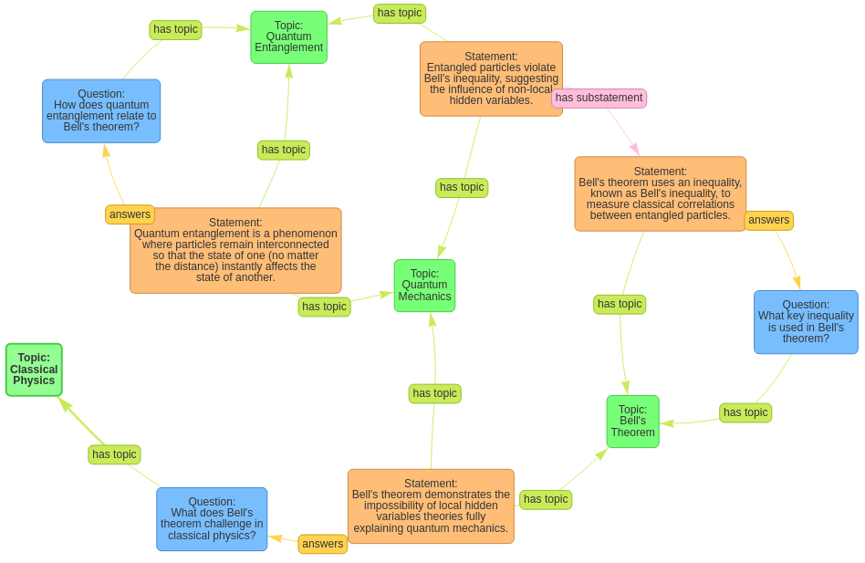

# Generating networks of questions and answers

We can try to use large language models to generate such a semantic network of physics questions and answers. Because the structure of the network is quite complex and the resulting graph can contain circular dependencies, it is quite challenging to develop an algorithm that assembles the network step by step. Therefore, we try an approach were we ask the model to generate the whole network at once. This makes it possible for the model to not only generate the text content of the network, but also the general structure of the network. To do this, we first need to define a text representation format of the network that the model should use. We choose a JSON format that contains the questions, statements and topics as well as the relations between them. This format needs to be explained to the model in the prompt that we use to generate the network. To make the model understand which type of network it should generate, we also need to provide an example of a network in this format. Therefore, we choose the example from the previous section and convert it into the JSON format. We also provide the model with a topic that it should generate a network for. This topic is also included in the prompt. Finally, we run some tests on the generated networks to check if their format is correct and repeat the generation process until we get a network that contains no errors. The resulting network is then visualized using the same algorithm as in the previous section. 

For the evaluation a total of 20 networks were generated for different topics and analyzed. The generated networks have between 11 and 22 nodes and between 9 and 22 edges. They contain an average of 6.1 statements, 4.5 questions and 4.4 topics. The average number of "answers" relations is 4.9, the average number of "has topic" relations is 8.4 and the average number of "has substatement" relations is 1.5. In all 20 networks, there is only one occurrence of the "is contradiction to" relation. The topologies of the generated networks are quite diverse. They vary from star shaped networks with a cental topic node to more complex highly interconnected networks and even disconnected networks with multiple components. 

The connections "answers" and "has topic" are mostly used correctly, but the connection "has substatement" is often used incorrectly. Instead of connecting a statement with a partial statement, the model often uses this connection to connect a statement with a completely different statement. The connection "is contradiction to" is barely used, which is probably due to the fact that the model tries to avoid contradictions and generate only true statements. In the one example where this connection is used, the two statements "Reversible processes are idealized processes where the system remains in thermodynamic equilibrium" and "In practical situations, true reversibility is never achieved because it requires an infinite amount of time" are not really contradictory, but rather complementary because they distinguish between idealized and practical situations. 

The content of the generated statements is mostly correct, but sometimes not very precise. The second statement in the example above could be more precise by stating that this is the case for thermodynamics because in classical mechanics all processes are reversible withouth any time constraints. In an other example the model describes the right hand rule for the lorentz force without mentioning that it is only valid for positive charges. In general the model seems to have a good understanding of the topics and is able to generate correct statements about them. 

The following figure shows the network generated for the topic "Bell's theorem":

  

This network consists of four statements, three questions and four topics. The relation "answers" connects three of the statements with the questions. Two of these connections are correct, while in the third case the statement about quantum entanglement does not mention Bell's theorem and therefore does not answer the question "How does quantum entanglement relate to Bell's theorem?". The relation "has topic" connects all statements and questions with the four topics. The assignment of the topics to the statements and questions is correct even if the topics "quantum mechanics" and "Bell's theorem" would fit to all statements and questions. The one "has substatement" relation is not used quite correctly, because the statement about non-local hidden variables does not contain the statement that Bell's inequality is used to measure correlations between entangled particles.

[Data](https://github.com/gratach/master-database-files/tree/3597e683cd4d3fb9ed21281874e0192535ed0ad2/master-experimental/building_a_semantic_network_of_questions_and_answers/generatedhttps://github.com/gratach/master-database-files/tree/3597e683cd4d3fb9ed21281874e0192535ed0ad2/master-experimental/building_a_semantic_network_of_questions_and_answers/generated)
[Code](https://github.com/gratach/master-experimental/blob/a04ad9441d2867204cc33e3f8be470cd85cdd0a4/building_a_semantic_network_of_questions_and_answers.ipynb)
