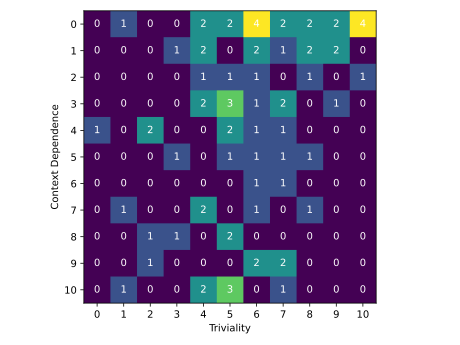
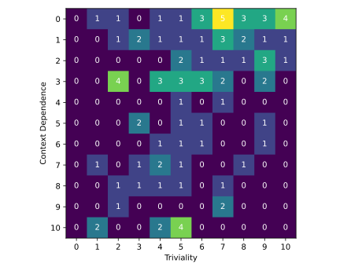
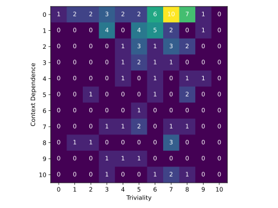
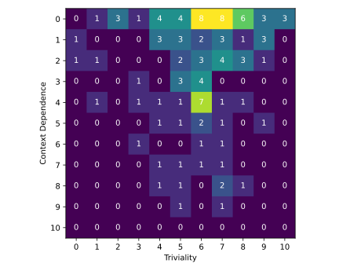

# Manual triple evaluation

To rate the the truth of the physics related semantic triples that are generated by the models ```gpt-4-turbo``` and ```gpt-3.5-turbo``` a manual evaluation was carried out. Therefore a total number of ==500 triples== was assessed manually. This triples can be divided into ==four groups of 125 triples== each that originate from the four [datasets](https://github.com/gratach/master-database-files/tree/main/master-adapted-subtopic-tree-generation/triples) ```tri_1_sel_gpt3_5```,  ```tri_1_sel_gpt4```,  ```free_ass_gpt3_5``` and  ```free_ass_gpt4```. This datasets differ in the way the triples were created. The ```tri_1_sel``` datasets contain ==correlated triples== that where generated by finding a predicate for a correlated pair of subject and object. (See [[correlated-triples-evaluation]]). The ```free_ass```datasets contain ==freely associated== triples that were created by finding a new predicate and a new object for a given subject. Each of these to categories was implemented using the models ```gpt-4-turbo``` and ```gpt-3.5-turbo```.

## The evaluation process

For the evaluation process four different aspects of the triples where investigated.
* **Validness**: Do the three terms fulfill all criteria of being a valid semantic triple? These criteria are:
	* The subject and object have to be concepts that contain a noun. For example "Fast particle" is a valid concept while "fast" by it self is not a valid concept.
	* Subject and object have stand by them self. For example the term "Extrasolar planet" is a valid concept while "Planet of that star" is not valid because it is containing a reference to a star, that is mentioned in the context.
	* The predicate has to be a text, that connects two concepts by creating an English sentence when placed between them.  It must not be dependent on a specific predicate and object.
* **Truth**: Is the statement of the semantic triple true? This can only be checked if the semantic triple is valid. The truth value is not always clearly defined. This is due to the fact, that some statements depend on the content. This means that they are true in some contexts and wrong in other contexts. For example the triple ```["Electron", "is accelerated by", "Particle accelerator"]``` is neither clearly true nor clearly false because not all electrons are accelerated by an particle accelerator. To answer the question whether this statement is true or not, it must first be determined what electron is subject to the debate. Also some statements can not be determined as true or false because they are subject of the current debate in science and there exist multiple theories about them. Therefore a statement can also be true in the context of one theory but false in the context of an other theory. For the evaluation each triple got one of the tree values "true", "false" or "unknown" assigned to it. The category "true" is for all triples that are true in some contexts. Only if there is clearly no common context where the triple is true it gets assigned to the category "false". The category "unknown" is for all those triples where the human evaluator does not know the truth value of the triple.
* **Context dependency**: How content dependent is the statement of the semantic triple? This can only be evaluated if the semantic triple is valid and true. For the evaluation a context dependency score value was assigned to each triple that is in the range from 0 to 10. As discussed about the context dependency is essential for the well-definedness of the triples truth value. This means, that only the true triples with an context dependency score of 0 can be considered as true in any scenarios. On the other hand a true triple with a context dependency score of 10 is only true in very specific contexts. If the context dependency score of a true triple is 5 it is approximately true in 50% of the commonly used contexts.
* **Triviality**: How trivial is the statement of the semantic triple? This can only be evaluated if the semantic triple is valid. The triviality score that is assigned to every triple ranges from 0 to 10. A low triviality score means that the evaluation of the triple requires expertise in the respective field while a high triviality score means that the truth value of the triple is obvious when considering general knowledge. In particular, predicates like "Is related to" lead to a high triviality score because they are very general and apply to most pairs or subjects and objects.

## Results

Of the 500 evaluated triples, ==461 where classified as valid triples==. Of those valid triples ==382 where marked as true==, ==63 where marked as false== and ==16 where marked as unknown== to the human evaluator.

The percentage of the valid triples out of all evaluated triples:

|                          | gpt 3.5 turbo correlated | gpt 4 turbo correlated | gpt 3.5 turbo free association | gpt 4 turbo free association |
| ------------------------ | ------------------------ | ---------------------- | ------------------------------ | ---------------------------- |
| Valid triples percentage | 97.6±1.3%                | 100%                   | 77.6±3.7%                      | 93.6±2.2%                    |
The table shows that the triples, that where generated by piking a predicate for a pair of correlated subject and objects, have a higher chance of being valid than the freely associated triples. Besides that the model ```gpt-4-turbo``` is better in generating valid triples then the model ```gpt-3.5-turbo```. This is especially true for the freely associated triples.

An example of an invalid correlated triple that was generated by ```gpt-3.5-turbo``` is ```["Elementary particle", "has a negative charge", "Electron"]```. The predicate ```"has a negative charge"``` is not valid because it is not linking two concepts with each other. An valid triple would be ```"Elementary particle", "has a negatively charged instance", "Electron"```. 

An example of an invalid freely associated triple that was generated by ```gpt-3.5-turbo``` is ```["Canonical quantum gravity", "is a theoretical framework", "in the field of quantum gravity"]```. This is due to the fact that the term ```"in the field of quantum gravity"``` is not a standalone concept but part of a sentence. The valid version of this triple is: ```["Canonical quantum gravity", "is a theoretical framework in", "the field of quantum gravity"]```

An example of an invalid freely associated triple that was generated by ```gpt-4-turbo``` is ```["Spin foam", "aims to", "unify general relativity and quantum mechanics"]```. Like in the last example, the triple is not valid because the object is not a standalone concept. In this case to, it can be corrected by moving one word from the object to the predicate: ```["Spin foam", "aims to unify", "general relativity and quantum mechanics"]```

The percentage of the true triples out of all valid triples without unknown truth value;

|                         | gpt 3.5 turbo correlated | gpt 4 turbo correlated | gpt 3.5 turbo free association | gpt 4 turbo free association |
| ----------------------- | ------------------------ | ---------------------- | ------------------------------ | ---------------------------- |
| True triples percentage | 67.5±4.3%                | 80.5±3.6%              | 98.9±1.0%                      | 99.1±0.8%                    |
There is a clear difference between the true triple share of the correlated triples and the freely associated triples. The first contain much more false triples than the latter. This is due to the fact, that the models have more difficulties to find an appropriate predicate for a existing pair of terms than creating both predicate and object from scratch.

An example of a false, correlated triple that was created by ```gpt-3.5-turbo``` is ```["Elementary particle", "is a", "D meson"]```. A D-meson is not a elementary (indivisible) particle because it is composed of a charm quark and a lighter quark. An better choice for an predicate would have been ```"is contained twice in"``` instead of ```"is a"```. 

An example of a false, correlated triple that was created by ```gpt-4-turbo``` is ```["Centripetal force", "is considered a", "Fictitious force"]```. In fact, the centripetal force which forces a mass to move in a curved path around a central point is a real force. Instead the centrifugal force that seams to accelerate an object away from the center of a rotated frame is a fictitious force. A correct choice of a predicate would have been ```"is not a"``` instead of ```"is considered a"```.

The valid semantic triples of both models ```gpt-4-turbo``` and ```gpt-3.5-turbo``` have such a high quality that there could be only identified one false triple each in both of the datasets.

The wrong triple in the ```gpt-3.5-turbo``` free association dataset is: ```["Harmonic oscillator", "is a type of", "oscillatory motion"]```. This triple is false because the harmonic oscillator is not itself the motion. Instead it is the structure that performs it. For this reason an true version of this triple would have been ```["Harmonic oscillator", "performes a type of", "oscillatory motion"]```.

The wrong triple in the ```gpt-4-turbo``` free association dataset is: ```["Stack effect", "increases", "indoor air pressure at higher elevations"]```.  When a building has no stack, the indoor pressure equalizes to the external atmospheric pressure trough the leaks in windows, doors and walls. When a chimney is added to the building a column of warm air connects the indoor volume with the higher elevated outdoor air that has a lower pressure than on the ground level. In hydrostatics the change of the pressure $p$ by the height $\mathsf h$ can be calculated from the density $\rho$ and the gravitational acceleration $g$.

$$\frac{\partial p}{\partial\mathsf h}=-\rho g$$
Because the density of the warm air in the chimney is lower than the cold air outside the pressure distance between the upper and lower end of the chimney is smaller than for the same vertical distance outside. This results in the indoor air being sucked in by the chimney. Thereby the indoor pressure decreases. A correct triple would be ```["Stack effect", "decreases", "indoor air pressure"]```.

The average context dependency score of all valid triples:

|                                  | gpt 3.5 turbo correlated | gpt 4 turbo correlated | gpt 3.5 turbo free association | gpt 4 turbo free association |
| -------------------------------- | ------------------------ | ---------------------- | ------------------------------ | ---------------------------- |
| Average context dependency score | 3.82±0.39                | 3.56±0.34              | 2.65±0.33                      | 2.27±0.24                    |
The table shows, that the freely associated triples are less dependent on the context then the correlated triples. Also the model ```gpt-4-turbo``` produces slightly less context dependent triples than the model ```gpt-3.5-turbo```

An example of a triple with a low context dependency score is ```["Electron shell", "contains", "Electrons"]```. This statement is true in all contexts. There is no situation where an electron shell does not contain any electrons. On the other hand the triple ```["Ring system", "surrounds", "Asteroid"]``` with a context dependency score of 10 is not true for most asteroids. But indeed a ring system has been detected around the asteroid ```(10199) Chariklo``` [source](https://www.nature.com/articles/nature13155)

The average triviality score of all valid triples:

|                          | gpt 3.5 turbo correlated | gpt 4 turbo correlated | gpt 3.5 turbo free association | gpt 4 turbo free association |
| ------------------------ | ------------------------ | ---------------------- | ------------------------------ | ---------------------------- |
| Average triviality score | 5.70±0.26                | 5.75±0.25              | 5.61±0.21                      | 5.93±0.20                    |

```["Dark matter halo", "is composed of", "Dark matter"], true, true, 0, 10]```
```["Hubbard model", "predicts", "Mott insulator phase"], true, true, 0, 0],```

To display the properties of the true triples, a heat map of the context dependence plotted against the triviality was created for all four datasets.

gpt 3.5 turbo correlated:



gpt 4 turbo correlated:


gpt 3.5 turbo free association:


gpt 4 turbo free association:

