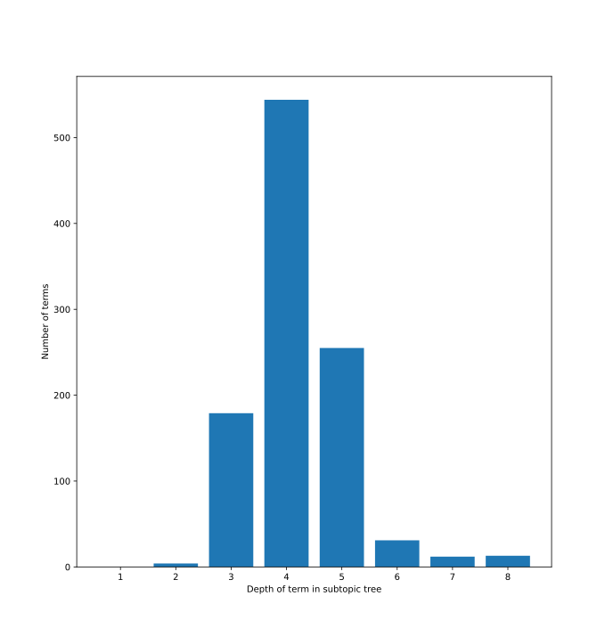
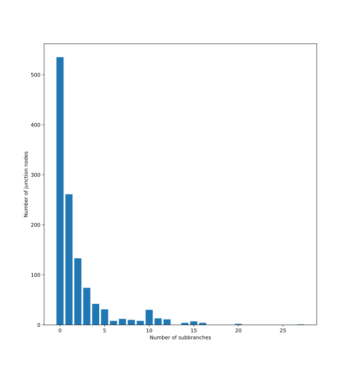

# Physics term adapted subtopic tree evaluation free association algorithm

Evaluation of the subtopic tree generated from the ==free association algorithm== of the [master-adapted-subtopic-tree-generation](../../code/projects/master-adapted-subtopic-tree-generation.md) project and the [technical terms](https://github.com/gratach/master-database-files/blob/bcf75729e024abb289219e831c339a6292d6eb82/master-keyword-extraction/technical_terms.txt). The json data of the subtopic tree is [here](https://github.com/gratach/master-database-files/blob/8c77208d89ec229f8077c500db32a7a5347c35aa/master-adapted-subtopic-tree-generation/free_association_algorithm/gpt4/subtopic_tree.json). The evaluation of the subdivision algorithm is [here](physics-term-adapted-subtopic-tree-evaluation.md).

## General properties

The subtopic tree contains ==1038 leafs== and 651 supporting junction nodes. In average each leaf has a ==depth of 4.21== within the subtopic tree. The distribution of the leaf depth looks as follows:

The following plot shows the number of junction nodes that have a given number of subbranches attached to them.

