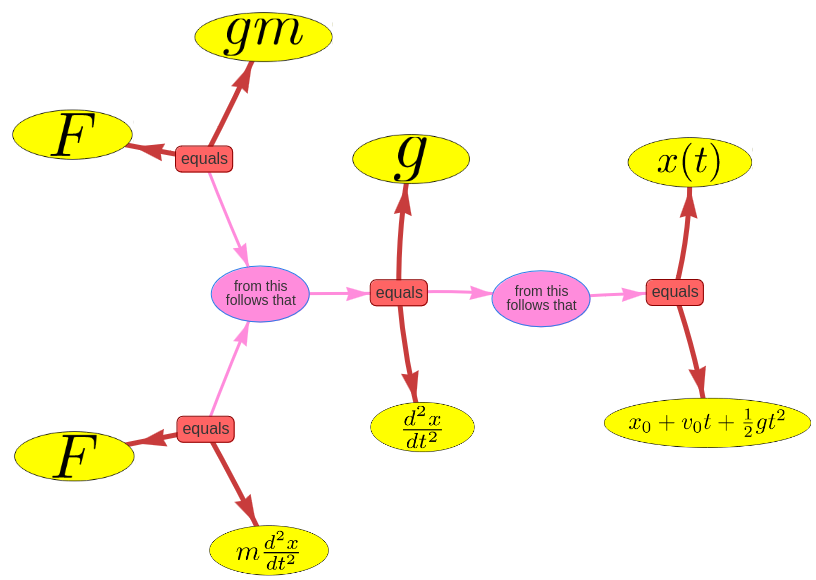
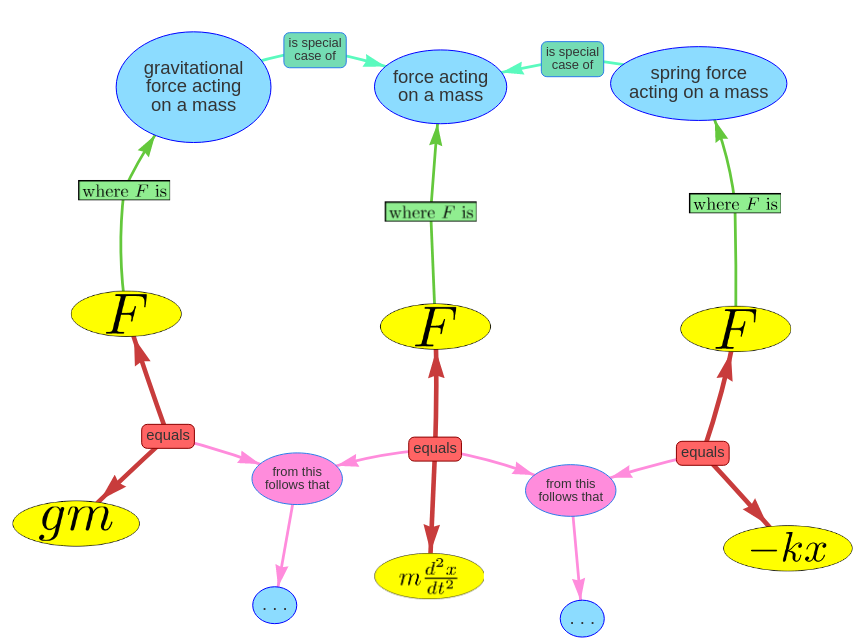
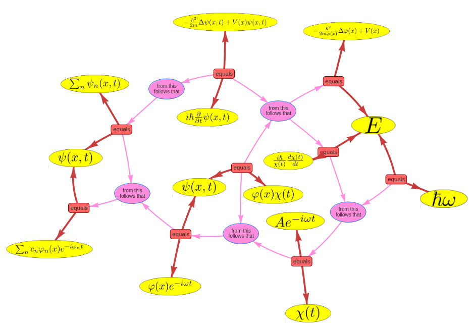
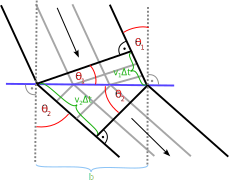
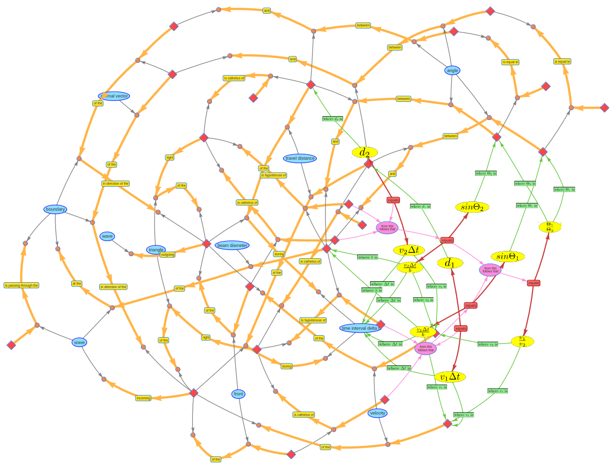

# Represent a derivation as semantic network

A central aspect of physical science is the process of deriving new conclusions from certain basic assumptions using the rules of logic and mathematics. In the following, we will examine the question of whether it is possible to represent such derivations as a semantic network and what the difficulties are in doing so. 

## Represent derivations using a network of equations

In the [previous section](../approaches/network-of-equations.md) we have used the toolbox of semantic networks to represent equations and explain their symbols. We now want to extend the ontology and add a new connection type that represents the deduction of one equation from an other. The "from this follows that" connection node can connect with multiple input equations that can be recognized by the arrows pointing from the equation to the node and with multiple output equations that can be recognized by the arrows pointing from the node to the equation. This should indicate that the output equations can be derived from the input equations.

The graphic below shows the graph representation of the solution to the free fall differential equation. The symbol explanations have been omitted for clarity. 

The deduction process is organized in two steps. First the two equations $F = gm$ and $F = m \frac{d^2x}{d^2t}$ are combined into one differential equation and in the second step this differential equation is solved by the solution $x(t) = x_0 + v_0t + \frac{1}{2}at^2$.

## Handling multiple different uses of the same symbol

It is quite common in physics that the same symbol is used for multiple slightly different quantities. For example the force $F$ in $F = m \frac{d^2x}{d^2t}$ is very general and could stand for many kinds of different forces. The example above has used the symbol $F$ for the more specific case of the gravitational force towards earth $F = g m$. But in some cases multiple forces occur at once. So what happens if the first equation gets linked with a second definition of a force for example the force of hooks law for a mass on a spring $F = -kx$? One could use two Symboles $F_1$ and $F_2$ but this wold mean, that also the first equation would have to be written twice: $F_1 = m_1 \frac{d^2x}{d^2t}$ and $F_2 = m_2 \frac{d^2x}{d^2t}$. The result would be that two equations with identical expressiveness but different notations occur within the semantic network and increase the complexity of the whole. One way to prevent this is using the same symbol $F$ with different definitions and a connection that indicates that one definition of $F$ is a special case of the other definition of $F$. This solution is shown in the graphic below.



## Represent a complex derivation as network of equations


The next graphic shows the derivation of the general solution for the one-dimensional Schrödinger equation of a particle in the time-independent potential. Again, the symbol explanations have been omitted. 


The derivation process starts with the Schrödinger equation.
$$
i\hbar\frac{\partial}{\partial t}\psi(x,t) = -\frac{\hbar^2}{2m}\Delta\psi(x,t)+V(x)\psi(x,t)
$$
It follows the approach of constructing the wave function as a product of two functions with separated variables for time and place:
$$
\psi(x,t) = \varphi(x)\chi(t)
$$
It than derives two equations for the space and for the time which are both equal to a new defined constant $E$ and sets this constant to $\hbar \omega$:
$$
\frac{i\hbar}{\chi(t)}\frac{d\chi(t)}{dt} = E = \hbar\omega =  -\frac{\hbar^2}{2m \varphi(x)}\Delta\varphi(x) + V(x)
$$
It than solves the differential equation of $\chi$ and introduces a new constant $A$:
$$
\chi(t) = Ae^{-i\omega t}
$$
It also establishes the linearity and states that a sum of solutions of the Schrödinger equation is also a solution of the Schrödinger equation:
$$
\psi(x,t) = \sum_n \psi_n(x, t)
$$
Finally it summarizes the results into the general solution:
$$
\psi(x,t) = \sum_n c_n\varphi_n(x)e^{-i\omega_n t}
$$
[automated-prove-checking](automated-prove-checking.md)
## The limitations of networks of equations

The previous results show, that it is possible to display some physical derivations as semantic network. What remains unanswered is the question whether this approach can be used to represent all derivations in physics. What speaks against it is that many derivations involve not only formulas but also natural language reasoning or drawn sketches which are used to clarify contextual relationships. These are both hard to incorporate in the semantic network. An simple example for a derivation, that can not be easily converted into a semantic network of equations is the derivation of Snell's law from the properties of waves. Snell's law states that at a transition between two media there is a relationship between the angle of incidence and emergence of a wave and the velocities of the wave, which is described by the following equation.
$$
\frac{\sin\Theta_1}{\sin\Theta_2} = \frac{v_1}{v_2}
$$
Here, $\Theta_1$ and $\Theta_2$ are the angles of incidence and emergence of the wave while $v_1$ and $v_2$ are the speed of the wave in the first and the second media. Snell's law can be derived from some geometrical calculations that are based on the consideration that a wave always moves at right angles to its wave front. 


This consideration and geometrical description of the problem can not be expressed solely by a semantic network of equations. 

## Combining a network of equations with a network of sentences

As a solution to the previous problem one could try to include the expressiveness of a [semantic network of sentences](../approaches/semantic-network-of-sentences.md) to complete the derivation. This would require describing the sketch using words. The following graphic shows a network of sentences with integrated equations that represents the derivation of Snell's law.


It describes the geometric properties by naming the catheti and hypotenuses of the triangles formed by the incoming and outgoing waves. It than derives the equations $sin\Theta_1 = \frac{v_1 \Delta t}{b}$ and $sin\Theta_2 = \frac{v_2 \Delta t}{b}$ from the description of the triangles. It therefore uses the hypotenuse $b$ and the opposite $d$ where $d = v\Delta t$. It then derives the equation $\frac{\sin\Theta_1}{\sin\Theta_2} = \frac{v_1}{v_2}$ in a final step.

This example shows, that a derivation, that can be described by words and formulas can also be represented by a semantic network.

[Code](https://github.com/gratach/master-experimental/blob/7b65ba0a152c8f96d6b9597874c986ba98394342/equation_network_derivation.ipynb)
[Data](https://github.com/gratach/master-database-files/tree/3ffd25c2b5581bc081e97a1cbc83a157f5644241/master-experimental/equation_networks_derivation)


[^fang]:```
@misc
{fang2024mathodysseybenchmarkingmathematicalproblemsolving,
      title={MathOdyssey: Benchmarking Mathematical Problem-Solving Skills in Large Language Models Using Odyssey Math Data}, 
      author={Meng Fang and Xiangpeng Wan and Fei Lu and Fei Xing and Kai Zou},
      year={2024},
      eprint={2406.18321},
      archivePrefix={arXiv},
      primaryClass={cs.CL},
      url={https://arxiv.org/abs/2406.18321}, 
} 
```