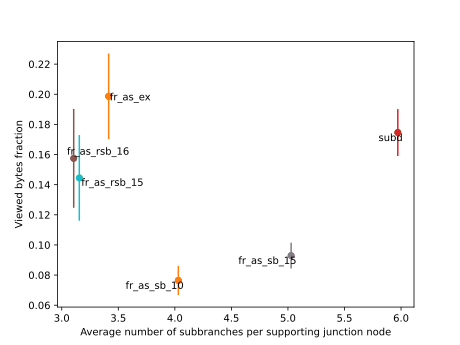

# Subtopic tree comparison

This plot shows the [viewed bytes percentage](subtopic-tree-average-number-of-viewed-terms-per-search-evaluation.md) in dependency of the average subbranches per junction for subtopic trees that are created from different creation methods and prompts. A lower viewed bytes fraction means a better quality of the subtopic tree.



Creation methods:

| Name         | Description                                                                                                                                                                                                                                                                                                                                                                                                               |
| ------------ | ------------------------------------------------------------------------------------------------------------------------------------------------------------------------------------------------------------------------------------------------------------------------------------------------------------------------------------------------------------------------------------------------------------------------- |
| subd         | The subdivision algorithm starts from a subtopic tree consisting only of the root node and adds new concepts one by one to this tree. If the number of subbranches at a given branch surpasses a threshold the tree is subdivided at this place and a new branch is inserted at this place.                                                                                                                               |
| fr_as_ex     | The free association algorithm with subtopic extension is an algorithm where the new subtopic branches are freely associated by the large language model. The new concepts are classified one by one in the tree. When ever the LLM comes to the conclusion that there is no appropriate subbranch to classify the concept the branch is extended by an additional subtopic branch that forms a category for the concept. |
| fr_as_rsb_15 | The freely associated algorithm with 15 root subbranches is an algorithm where the new subtopic branches are freely associated by the large language model. Thereby the model is prompted to generate a total number of 15 subbranches for the root node. For all other branches it can freely decide how many subbranches it generates.                                                                                  |
| fr_as_rsb_16 | Like the ```fr_as_rsb_15``` algorithm, but with 16 root subbranches.                                                                                                                                                                                                                                                                                                                                                      |
| fr_as_sb_15  | The free associated algorithm with 15 subbranches is an algorithm where the new subtopic branches are freely associated by the large language model. Thereby the model is prompted to generate a total number of 15 subbranches for all branches.                                                                                                                                                                         |
| fr_as_sb_10  | Like the ```fr_as_sb_15``` algorithm, but with 10 subbranches per branch.                                                                                                                                                                                                                                                                                                                                                 |
Note that the error bars only show the ==viewed bytes percentage error== for the evaluation of ==a single subtopic tree== that was generated by the creation algorithm not the error that originates from multiple different subtopic tree creations.

Here is a table statistical properties of the subtopic trees created with different creation methods:

| Tree         | Average term depth | Average number of subbranches per supporting junction node | Average viewed nodes fraction | Average viewed bytes fraction | Average choice correctness percentage |
| ------------ | ------------------ | ---------------------------------------------------------- | ----------------------------- | ----------------------------- | ------------------------------------- |
| fr_as_ex     | 4.21               | 3.41                                                       | 19.66 ± 2.79%                 | 19.86 ± 2.84%                 | 69.53 ± 2.35%                         |
| subd         | 5.36               | 5.97                                                       | 13.84 ± 1.21%                 | 17.46 ± 1.56%                 | 82.87 ± 1.31%                         |
| fr_as_rsb_16 | 4.54               | 3.11                                                       | 16.77 ± 3.47%                 | 15.75 ± 3.28%                 | 73.3 ± 3.33%                          |
| fr_as_sb_15  | 3.31               | 5.03                                                       | 10.189 ± 0.929%               | 9.295 ± 0.855%                | 74.36 ± 2.47%                         |
| fr_as_rsb_15 | 4.41               | 3.16                                                       | 15.46 ± 3.07%                 | 14.45 ± 2.84%                 | 70.68 ± 3.29%                         |
| fr_as_sb_10  | 3.86               | 4.03                                                       | 7.697 ± 0.962%                | 7.642 ± 0.962%                | 76.62 ± 2.99%                         |
[Code](https://github.com/gratach/master-adapted-subtopic-tree-generation/blob/65a374f65a1bec8a2a8e9d32636b29f9bc52ef0d/subtopic_tree_generation.py)
[Data](https://github.com/gratach/master-database-files/tree/fbc09d739139d9fff837831db46cfd9e19f5cf30/master-adapted-subtopic-tree-generation/trees)