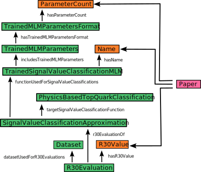

# R30 value extraction

In the next step we want to insert data into the ontology. Therefore we focus on the task of extracting a specific quantity from physics papers. We want to compare the R30 value and the parameter count of different top quark tagging machine learning models. Top quark tagging refers to the process of identifying jets in particle detector data that originate from the decay of top quarks. This identification is challenging due to the complex and energetic nature of top quark decays. A top quark typically decays into a W boson and a bottom quark (b quark), with the W boson further decaying into either a pair of quarks or a lepton and a neutrino. 

A top tagging algorithm recognizes the fingerprints of these decay products in the detector data and uses this to decide if a specific particle event contains a top quark. Usually the sensitivity of such an algorithm can be adjusted so that it can find a higher percentage of the top quark events within the dataset. This comes to the cost of also producing a higher false positive rate of events without top quarks. The R30 value is the inverse of the false positive rate at a signal efficiency of 30%. A higher R30 value means a better top tagging performance. The second quantity that should be extracted is the parameter count of different top tagging machine learning models. This is the number of trainable parameters in the neural network of the machine learning model. A higher number of parameters usually means, that it needs more compute power to train and use the corresponding machine learning model.

These two values should be extracted from a small number of papers to compare the top tagging performance of different machine learning models. Even though it would be an option to extract the data manually we chose an automated approach to demonstrate that it is possible to fill semantic network with data, that has been scraped from the internet by automated algorithms.

Extracted values:
number of papers used for table extraction: 39
number of papers used for value extraction: 10
number of extracted tables: 124
number of tables used for R30 extraction: 13
number of tables used for parameter count extraction: 9
number of extracted models: 39
number of extracted R30 values: 54
number of extracted parameter count values: 48

RDF graph:
Number of named individuals in the ontology: 386 
Number of connections between named individuals in the ontology: 603 
Number of triples in the ontology: 1631

(old)
[Code](https://github.com/gratach/master-thesis/blob/main/semantic_paper/scripts/collect_R30_values.py)
[Data](https://github.com/gratach/master-database-files/blob/c7985e94d53392ba468c72cb238b25783146e2b1/master-thesis/r30-evaluation/referenced_papers/parameters.yaml)

(new)
[Code](https://github.com/gratach/master-experimental/blob/d8fdc65b320011bfbe7490933cea5c9648b44020/populate_knowledge_graph_with_r30.ipynb)
[Data (graph)](https://github.com/gratach/master-database-files/blob/d6a77955135191b52ad8ea4bbcaa3cd695bb3c32/master-experimental/populate_knowledge_graph_with_r30/ontology.ttl) 
[Data (ontology)](https://github.com/gratach/master-experimental/blob/221410539c433d9d5e76f684c13c5caf7b225514/mlPhysOnto.ttl)
