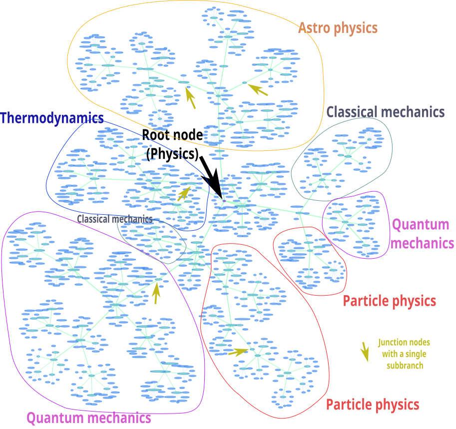
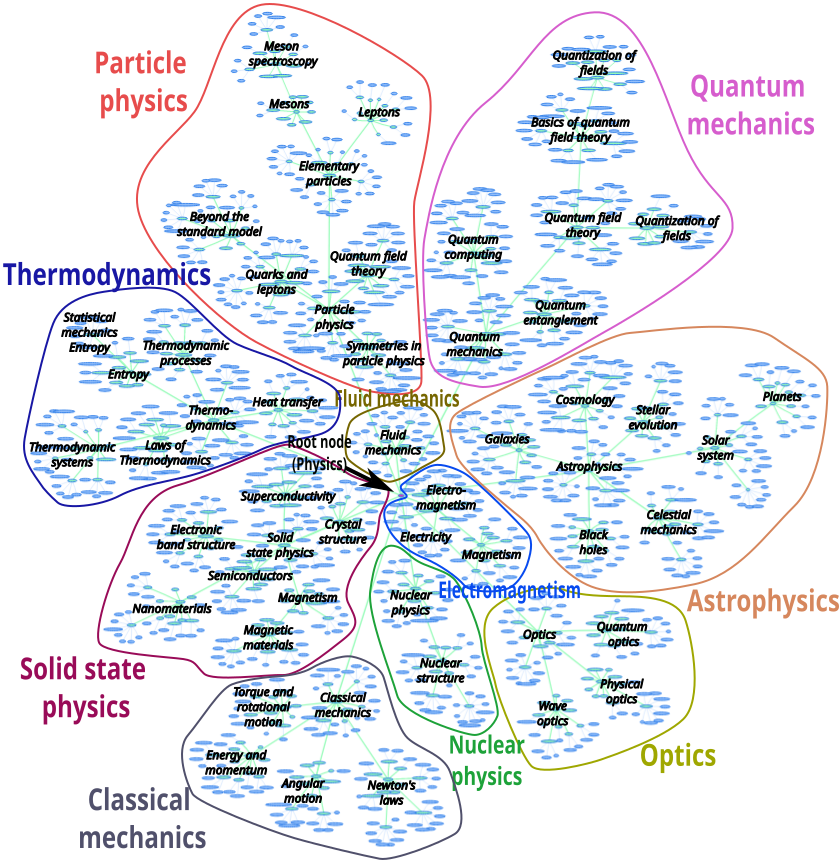

# Visualization of the subtopic trees

The subtopic trees can be visualized as graph using the ```vis.js``` library. Thereby the leaf nodes of the subtopic tree are colored in blue while the junction nodes are colored in blue. The graphic below shows an overview over the ```subd``` tree. The root node, which is colored in pink can be seen in the right center.

The image shows the irregular structure of the subtopic tree generated by the subdivision algorithm. Some branches are longer than others

[Code](https://github.com/gratach/master-experimental/blob/a04ad9441d2867204cc33e3f8be470cd85cdd0a4/visualize_subtopic_trees.ipynb)
