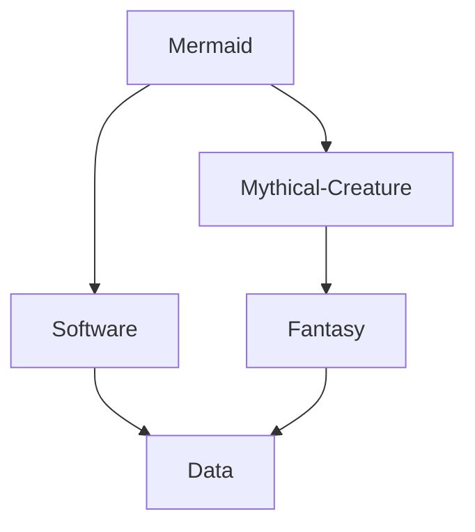

# Mermaid diagramming

[Mermaid](https://en.wikipedia.org/wiki/Mermaid_(software)) is a software to generate diagrams from text based descriptions:


This diagram can be created with this text:
```
graph TB;
    Mermaid--> Software & Mythical-Creature
    Software--> Data
    Mythical-Creature--> Fantasy
    Fantasy--> Data
```

## Install with npm
```
npm install -g @mermaid-js/mermaid-cli
```
## Test in console
```
cat << EOF  | mmdc --input - -o output.png
graph TB;
    Mermaid--> Software & Mythical-Creature
    Software--> Data
    Mythical-Creature--> Fantasy
    Fantasy--> Data
EOF
```